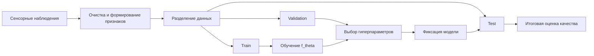
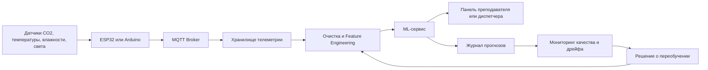
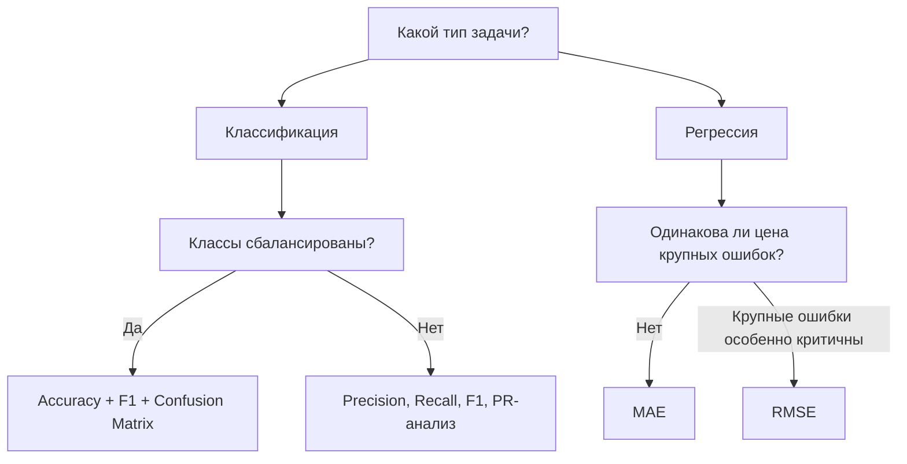
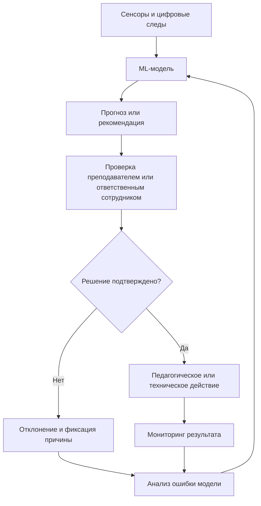

# Раздел 1. «Понятие машинного обучения»

## Дисциплина «Технологии машинного обучения»

**Магистратура 44.04.01 «Педагогическое образование»**  
Профиль: **«Умные системы и интернет вещей в образовании»**

Фокус раздела: от постановки задачи и жизненного цикла сенсорных данных до корректного оценивания моделей и ответственного применения ИИ в образовательной организации.

---

## Результаты освоения раздела

После изучения раздела магистрант должен уметь:

- формулировать задачу машинного обучения через объекты, признаки и целевую переменную;
- различать классификацию, регрессию и кластеризацию;
- корректно разделять данные на обучающую, валидационную и тестовую части;
- проектировать жизненный цикл данных для IoT-системы;
- выбирать метрики с учетом инженерной цены ошибок;
- выявлять Data Leakage и Concept Drift;
- оценивать риски Bias, Privacy и Fairness;
- проектировать контур Human-in-the-loop для педагогически значимых решений.

---

# Тема 1. Машинное обучение как технология построения интеллектуальных систем

## Базовые понятия

**Объект** — наблюдение, для которого строится прогноз. В IoT-кейсе объектом может быть состояние аудитории в момент времени $t$.

**Признаки** — измеряемые характеристики объекта:

$$
x = [x_1, x_2, \ldots, x_p] \in X.
$$

Например:

- $x_1$ — концентрация CO₂, ppm;
- $x_2$ — температура, °C;
- $x_3$ — относительная влажность, %;
- $x_4$ — освещенность, lux.

**Целевая переменная**:

$$
y \in Y.
$$

Для задачи занятости аудитории:

$$
Y = \{0,1\},
$$

где $0$ — помещение свободно, $1$ — занято.

---

## Обучающая, валидационная и тестовая выборки

Исходный набор данных $D$ разделяется на независимые части:

- **Train** — подбор параметров модели;
- **Validation** — выбор гиперпараметров и сравнение вариантов;
- **Test** — итоговая оценка уже выбранного решения.

Типовая запись:

$$
D = D_{train} \cup D_{val} \cup D_{test}.
$$

Например:

$$
70\% + 15\% + 15\%.
$$

Тестовая выборка не должна использоваться для настройки модели. Иначе итоговая оценка перестает быть независимой оценкой способности модели к обобщению.

---

## Обучение с учителем и без учителя

### Обучение с учителем

Для каждого объекта известна целевая переменная $y$.

Типовые задачи:

- **классификация** — дискретный класс;
- **регрессия** — числовое значение.

Примеры:

- определить, занята ли аудитория;
- прогнозировать CO₂ через 30 минут;
- оценить энергопотребление лаборатории.

### Обучение без учителя

Целевой переменной нет. Алгоритм ищет структуру в данных.

Пример: кластеризация режимов работы лаборатории на «урок», «перемена», «помещение пустует», «аномальный режим».

---

## Формализация обучения

Модель задается отображением

$$
f_\theta: X \rightarrow Y,
$$

где $\theta$ — обучаемые параметры.

Обучение можно представить как минимизацию эмпирического риска:

$$
\theta^* = \arg\min_\theta \frac{1}{N}\sum_{i=1}^{N} L(f_\theta(x_i), y_i).
$$

Здесь:

- $N$ — число обучающих объектов;
- $L$ — функция потерь;
- $f_\theta(x_i)$ — прогноз;
- $y_i$ — правильный ответ.

Инженерный смысл: алгоритм ищет параметры, уменьшающие ошибку на обучающих примерах, но конечная цель — хорошая работа на новых данных.

---

## Переобучение и недообучение

### Underfitting — недообучение

Модель слишком проста и не описывает закономерность:

- высокая ошибка на Train;
- высокая ошибка на Validation/Test.

### Overfitting — переобучение

Модель запоминает детали обучающей выборки:

- очень низкая ошибка на Train;
- существенно более высокая ошибка на Validation/Test.

Обобщающая способность определяется не качеством на обучении, а качеством на **невидимых ранее данных**.

---

## Bias–variance как инженерная идея

Условно ошибку модели можно интерпретировать через компромисс:

- высокий **bias** — модель слишком проста;
- высокая **variance** — модель слишком чувствительна к конкретной выборке.

Средства борьбы с переобучением:

- больше данных;
- регуляризация;
- ограничение сложности;
- корректная кросс-валидация;
- ранняя остановка для нейронных сетей;
- контроль утечки данных.

---

## Кейс: «Аудитория занята или свободна?»

### Данные

Каждые 60 секунд система получает:

| Признак | Пример |
|---|---:|
| CO₂ | 910 ppm |
| Температура | 23.4 °C |
| Влажность | 41 % |
| Освещенность | 420 lux |

Цель:

$$
y =
\begin{cases}
1, & \text{аудитория занята},\\
0, & \text{аудитория свободна}.
\end{cases}
$$

Методическая ценность кейса: он связывает физические процессы, IoT, статистику и ML. При этом высокая концентрация CO₂ не является прямым доказательством присутствия конкретного человека.

---

## Схема: обучение и честная проверка модели



Ключевой принцип: **Test используется только после завершения выбора модели**.

---

## Сопоставление с ведущими курсами

Структура темы соответствует фундаментальной логике:

- **Stanford CS229** — supervised/unsupervised learning, bias–variance, practical advice;
- **MIT 6.390** — problem formulation, supervised/unsupervised learning, evaluation criteria;
- **UC Berkeley CS189** — regression, classification, trees, neural networks, ensembles, clustering и dimensionality reduction.

Для профиля «Умные системы и интернет вещей в образовании» этот фундамент переносится на сенсорные данные и инженерно-педагогические сценарии.

---

# Тема 2. Жизненный цикл данных в интеллектуальной образовательной системе

## Сквозной жизненный цикл

$$
\text{Sense}
\rightarrow
\text{Collect}
\rightarrow
\text{Store}
\rightarrow
\text{Clean}
\rightarrow
\text{Feature}
\rightarrow
\text{Train}
\rightarrow
\text{Validate}
\rightarrow
\text{Deploy}
\rightarrow
\text{Monitor}.
$$

Машинное обучение начинается не с вызова `model.fit()`, а с проектирования измерений.

Качество решения ограничивается:

- качеством сенсоров;
- корректностью временных меток;
- полнотой передачи;
- единообразием калибровки;
- качеством разметки;
- стабильностью распределения данных.

---

## Sense и Collect: как рождаются данные

### Частота дискретизации

Пусть частота измерений равна $f_s$.

Период:

$$
T_s = \frac{1}{f_s}.
$$

Для медленно меняющихся параметров микроклимата обычно не требуется частота IMU-уровня.

Пример:

- CO₂: 1 измерение в 30–60 секунд;
- температура: 1 измерение в 30–60 секунд;
- IMU образовательного робота: десятки или сотни измерений в секунду.

Частота измерений должна соответствовать динамике физического процесса.

---

## Временные метки и синхронизация

Каждое измерение должно иметь timestamp:

```text
2026-09-09T14:15:00+03:00
```

Проблемы:

- часы ESP32 могут расходиться;
- пакет может прийти позже момента измерения;
- разные сенсоры могут иметь разные частоты;
- пакет может быть продублирован.

Необходимо различать:

- **event time** — когда измерение произошло;
- **processing time** — когда измерение обработано системой.

Для анализа временных рядов предпочтительно привязываться к event time.

---

## Потеря пакетов, выбросы и калибровка

### Потеря пакетов

Доля пропусков:

$$
r_{miss} = \frac{N_{missing}}{N_{expected}}.
$$

### Выбросы

Причины:

- аппаратный сбой;
- прогрев датчика;
- кратковременное электромагнитное воздействие;
- ошибка преобразования единиц;
- неверная калибровка.

### Калибровка

Если сенсор систематически завышает CO₂ на 80 ppm, модель может «выучить» ошибку конкретного устройства.

---

## Скользящее окно

Для сенсорных данных часто используются признаки по окну длины $W$:

$$
\bar{x}_t =
\frac{1}{W}
\sum_{k=0}^{W-1}x_{t-k}.
$$

Можно вычислять:

- среднее;
- медиану;
- минимум и максимум;
- стандартное отклонение;
- скорость изменения;
- разность между текущим и предыдущим значением.

Окно превращает поток измерений в признаки, описывающие локальную динамику.

---

## Data Leakage — утечка данных

**Data Leakage** возникает, когда модель получает информацию, недоступную в реальном моменте прогнозирования.

Примеры:

1. При прогнозе CO₂ на 14:30 используется значение CO₂ в 14:35.
2. Нормализация вычислена по всей выборке до разделения на Train/Test.
3. Записи одной и той же учебной сессии случайно попали одновременно в Train и Test.
4. Целевая метка косвенно закодирована в одном из признаков.

Утечка почти всегда приводит к **искусственно завышенным метрикам**.

---

## Concept Drift — дрейф концепта

Пусть модель оценивает зависимость

$$
P(y|x).
$$

**Concept Drift** — изменение этой зависимости во времени.

В образовательной среде причины:

- смена расписания;
- новое вентиляционное оборудование;
- другой режим использования кабинета;
- изменение числа обучающихся;
- новая прошивка датчика;
- сезонность.

Модель, обученная в сентябре, может ухудшиться зимой.

---

## Как обнаруживать дрейф

Наблюдают:

- распределения признаков;
- частоту классов;
- среднюю ошибку;
- долю пропусков;
- долю аномалий;
- изменение статистик по времени.

Например:

$$
\Delta \mu =
|\mu_{current}-\mu_{train}|.
$$

Если сдвиг устойчив и сопровождается ухудшением метрик, требуется повторная проверка и, возможно, переобучение.

---

## Архитектура IoT-потока умного класса



Критически важно, что ML-сервис — лишь один компонент системы, а не вся система.

---

## Прикладной кейс: ESP32 в умной аудитории

Минимальный пакет телеметрии:

```json
{
  "device_id": "room_410_esp32_01",
  "timestamp": "2026-09-09T14:15:00+03:00",
  "co2_ppm": 842,
  "temperature_c": 23.2,
  "humidity_pct": 42.1,
  "light_lux": 385
}
```

Перед обучением модели необходимо проверить:

- единицы измерения;
- частоту измерений;
- повторяющиеся записи;
- пропуски;
- синхронизацию времени;
- диапазоны физических значений.

---

# Тема 3. Постановка инженерной ML-задачи и выбор метрики

## От задачи к критерию качества

Перед выбором алгоритма необходимо определить:

1. что является объектом;
2. какой прогноз нужен;
3. на каком горизонте;
4. какова цена ошибок;
5. какая метрика отражает инженерную цель.

Пример:

> определить риск превышения CO₂ 1400 ppm в ближайшие 30 минут.

Это не просто «классификация», а задача с асимметричной стоимостью ошибок.

---

## Матрица ошибок

Для бинарной классификации:

| | Прогноз 1 | Прогноз 0 |
|---|---:|---:|
| Истина 1 | TP | FN |
| Истина 0 | FP | TN |

Где:

- **TP** — опасное состояние обнаружено;
- **FN** — опасное состояние пропущено;
- **FP** — ложная тревога;
- **TN** — нормальное состояние корректно распознано.

Для вентиляции FN может быть существенно опаснее FP.

---

## Precision, Recall и F1

$$
Precision = \frac{TP}{TP+FP}
$$

$$
Recall = \frac{TP}{TP+FN}
$$

$$
F_1 =
2\frac{Precision \cdot Recall}{Precision + Recall}
$$

### Интерпретация

- высокий Precision: большинство тревог обоснованы;
- высокий Recall: большинство опасных ситуаций обнаружено;
- $F_1$ балансирует Precision и Recall.

---

## Почему Accuracy может быть опасной

Пусть в 10 000 минут наблюдений:

- 9 900 — нормальный CO₂;
- 100 — опасное превышение.

Модель всегда говорит «норма».

Тогда:

$$
Accuracy = \frac{9900}{10000}=0.99.
$$

Формально — 99 %.

Но:

$$
Recall = 0.
$$

Система не обнаружила **ни одного** опасного события. Accuracy без анализа структуры классов может быть инженерно вводящей в заблуждение.

---

## MAE и RMSE для регрессии

Средняя абсолютная ошибка:

$$
MAE =
\frac{1}{n}
\sum_{i=1}^{n}
|y_i-\hat{y}_i|.
$$

Среднеквадратичная ошибка:

$$
RMSE =
\sqrt{
\frac{1}{n}
\sum_{i=1}^{n}
(y_i-\hat{y}_i)^2
}.
$$

RMSE сильнее штрафует крупные ошибки.

Если критичны большие промахи прогноза температуры или энергопотребления, RMSE может быть информативнее MAE.

---

## Метрика должна соответствовать решению



Ни одна метрика не заменяет предметную интерпретацию ошибок.

---

## Инженерная постановка задачи: шаблон

Для учебных проектов рекомендуется фиксировать:

**1. Объект:** состояние аудитории раз в минуту.  
**2. Признаки:** CO₂, температура, влажность, свет.  
**3. Цель:** превышение CO₂ через 30 минут.  
**4. Горизонт:** $h=30$ минут.  
**5. Ошибка типа FN:** не включили вентиляцию вовремя.  
**6. Ошибка типа FP:** лишняя вентиляция.  
**7. Основная метрика:** Recall.  
**8. Ограничивающая метрика:** Precision не ниже заданного порога.

Так ML-задача связывается с реальным управленческим решением.

---

# Тема 4. Ответственный ИИ в образовательной среде

## Почему этика является системной частью ML

В образовании ML работает с данными, которые могут косвенно характеризовать:

- поведение;
- присутствие;
- активность;
- успеваемость;
- маршруты перемещения;
- взаимодействие с цифровой средой.

Следовательно, инженер должен оценивать не только точность, но и:

- справедливость;
- приватность;
- объяснимость;
- управляемость;
- возможность человеческого контроля.

---

## Bias и Fairness

**Bias** — систематическое смещение данных или решения.

Источники:

- сенсоры установлены только в части помещений;
- данные собраны только в один сезон;
- одна группа существенно чаще присутствует в датасете;
- разметка зависит от субъективной оценки.

**Fairness** требует анализа того, одинаково ли надежно решение работает в значимых подгруппах.

В образовательной системе нельзя считать одну агрегированную метрику достаточной.

---

## Privacy: минимизация данных

Принцип:

> собирать только те данные, которые необходимы для заявленной задачи.

Если занятость аудитории можно определить по CO₂ и свету, нет автоматической необходимости сохранять видеопоток с идентификацией лиц.

Предпочтительные меры:

- минимизация данных;
- псевдонимизация идентификаторов;
- ограничение срока хранения;
- разграничение доступа;
- журналирование доступа;
- обработка на Edge, если это уменьшает передачу персональных данных.

---

## Explainability / XAI

Объяснение должно отвечать на вопрос:

> почему система выдала этот прогноз?

Для классических моделей возможны:

- коэффициенты линейной модели;
- структура дерева;
- permutation importance;
- SHAP-подобные объяснения.

Важно различать:

- **объяснение поведения модели**;
- **причинное объяснение реального процесса**.

Высокая важность CO₂ не доказывает, что именно CO₂ является причиной педагогического результата.

---

## Корреляция не равна причинности

Если модель обнаружила:

> высокая температура связана с низкой активностью обучающихся,

нельзя автоматически заключить:

> высокая температура вызывает снижение учебных результатов.

Возможны скрытые факторы:

- время суток;
- длительность занятия;
- заполненность аудитории;
- тип учебной деятельности;
- сезон.

ML-модель прогнозирует зависимости, но причинные выводы требуют отдельного дизайна исследования.

---

## Аппаратный сбой как источник алгоритмической ошибки

Пример:

- датчик CO₂ завис на 400 ppm;
- ML-модель видит «идеальный воздух»;
- система управления вентиляцией не реагирует.

Следовательно, надежность должна включать:

1. диагностику оборудования;
2. проверку диапазонов;
3. обнаружение неизменяющихся сигналов;
4. резервные правила;
5. ручное подтверждение для критических действий.

---

## Human-in-the-loop

Педагогически значимое решение должно предусматривать участие человека.



Модель предоставляет **поддержку принятия решения**, а не заменяет профессиональную ответственность.

---

## Недопустимые автоматические выводы

Без дополнительной проверки нельзя автоматически:

- выставлять оценку только по предсказанию модели;
- считать отсутствие активности признаком отсутствия знаний;
- считать присутствие в аудитории доказательством участия;
- делать дисциплинарный вывод по одному сенсорному источнику;
- идентифицировать «слабого» обучающегося по непрозрачной модели.

Педагогическая валидность должна проверяться отдельно от вычислительной точности.

---

## Чек-лист ответственного ML-проекта

Перед внедрением ответьте:

1. Для чего собираются данные?
2. Можно ли собрать меньше?
3. Кто имеет доступ?
4. Как долго хранятся данные?
5. Есть ли группа, для которой модель хуже?
6. Можно ли объяснить результат?
7. Что произойдет при отказе датчика?
8. Может ли человек отменить решение?
9. Как фиксируются ошибки?
10. Кто отвечает за последствия?

---

## Итоги раздела

Главные идеи:

- ML — не отдельный алгоритм, а полный цикл работы с данными;
- качество начинается с корректной постановки задачи;
- Train/Validation/Test должны быть разделены по смыслу;
- Accuracy не универсальна;
- для IoT критичны timestamp, пропуски, калибровка и drift;
- Data Leakage делает метрики недостоверными;
- ответственное применение ИИ требует Privacy, Fairness, XAI и Human-in-the-loop;
- в образовании ML должен усиливать профессиональное решение, а не подменять его.

---

## Открытые источники и материалы

1. Stanford CS229: https://cs229.stanford.edu/
2. MIT 6.390 Introduction to Machine Learning: https://introml.mit.edu/
3. UC Berkeley CS189: https://www2.eecs.berkeley.edu/Courses/CS189/
4. MIT Social and Ethical Responsibilities of Computing: https://ocw.mit.edu/courses/res-tll-008-social-and-ethical-responsibilities-of-computing-serc/
5. Scikit-learn User Guide: https://scikit-learn.org/stable/user_guide.html

Материалы следует использовать с учетом лицензий и условий распространения соответствующих источников.
