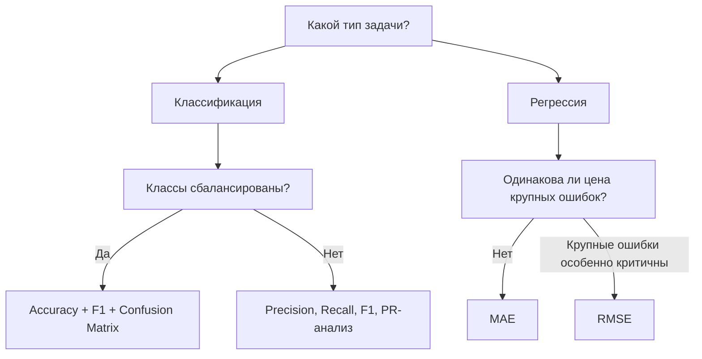
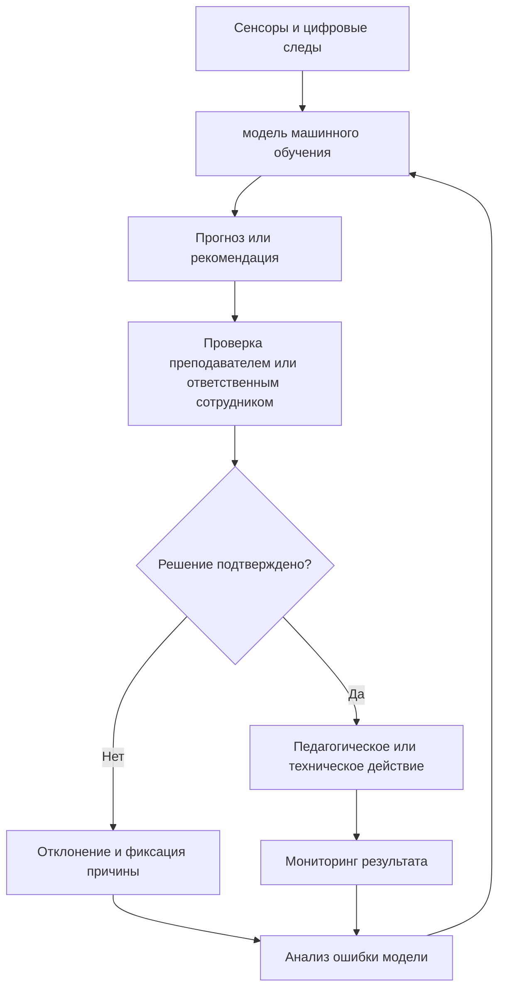

# Раздел 1. «Понятие машинного обучения»

## Дисциплина «Технологии машинного обучения»

**Магистратура 44.04.01 «Педагогическое образование»**  
Профиль: **«Умные системы и интернет вещей в образовании»**

Фокус раздела: от постановки задачи и жизненного цикла сенсорных данных до корректного оценивания моделей и ответственного применения ИИ в образовательной организации.

---

## Результаты освоения раздела

После изучения раздела магистрант должен уметь:

- формулировать задачу машинного обучения через объекты, признаки и целевую переменную;
- различать классификацию, регрессию и кластеризацию;
- корректно разделять данные на обучающую, валидационную и тестовую части;
- проектировать жизненный цикл данных для IoT-системы;
- выбирать метрики с учетом инженерной цены ошибок;
- выявлять утечку данных (data leakage) и дрейф концепта (concept drift);
- оценивать риски систематического смещения, нарушения приватности и несправедливости алгоритмических решений;
- проектировать контур «человек в цикле принятия решения» (human-in-the-loop) для педагогически значимых решений.

---

## Терминологические соглашения курса

В лекциях используется русская профессиональная терминология; английский эквивалент приводится при первом употреблении:

- **обучающая выборка** — training set;
- **валидационная выборка** — validation set;
- **тестовая выборка** — test set;
- **признак** — feature;
- **целевая переменная** — target;
- **функция потерь** — loss function;
- **переобучение** — overfitting;
- **недообучение** — underfitting;
- **утечка данных** — data leakage;
- **дрейф концепта** — concept drift.

Такой подход сохраняет связь с документацией библиотек, но не подменяет русскую научную терминологию англоязычным жаргоном.

# Тема 1. Машинное обучение как технология построения интеллектуальных систем

## Базовые понятия

**Объект** — наблюдение, для которого строится прогноз. В IoT-сценарии объектом может быть состояние аудитории в момент времени $t$.

**Признаки** — измеряемые характеристики объекта:

$$ x = [x_1, x_2, \ldots, x_p] \in X $$

**Обозначения:** $x$ — вектор признаков одного объекта; $x_j$ — значение $j$-го признака; $p$ — число признаков; $X$ — пространство допустимых описаний объектов.

**Смысл:** одна строка таблицы сенсорных данных рассматривается как точка в $p$-мерном пространстве признаков.

Например:

- $x_1$ — концентрация CO₂, ppm;
- $x_2$ — температура, °C;
- $x_3$ — относительная влажность, %;
- $x_4$ — освещенность, lux.

**Целевая переменная**:

$$ y \in Y $$

**Обозначения:** $y$ — целевая переменная; $Y$ — множество допустимых значений цели.

Для регрессии $Y$ обычно является числовым множеством, для классификации — конечным набором классов.

Для задачи занятости аудитории:

$$ Y = \{0,1\} $$

В задаче занятости аудитории удобно принять: $y=0$ — помещение свободно, $y=1$ — помещение занято.

**Важно:** это кодирование класса, а не числовая шкала «хуже–лучше».

где $0$ — помещение свободно, $1$ — занято.

---

## Обучающая, валидационная и тестовая выборки

Исходный набор данных $D$ разделяется на независимые части:

- **обучающая выборка** — подбор параметров модели;
- **валидационная выборка** — выбор гиперпараметров и сравнение вариантов;
- **тестовая выборка** — итоговая оценка уже выбранного решения.

Типовая запись:

**Разделение данных:** исходный набор $D$ делится на три непересекающиеся части: обучающую, валидационную и тестовую.

Математически важно не само обозначение объединения, а отсутствие информационного обмена между тестовой частью и процедурой выбора модели.

Например:

**Пример пропорции:** 70 % данных — обучение, 15 % — валидация, 15 % — итоговое тестирование.

Это не универсальное правило: при временных рядах разделение выполняют по времени, а при данных нескольких аудиторий — нередко по группам помещений.

Тестовая выборка не должна использоваться для настройки модели. Иначе итоговая оценка перестает быть независимой оценкой способности модели к обобщению.

---

## Обучение с учителем и без учителя

### Обучение с учителем

Для каждого объекта известна целевая переменная $y$.

Типовые задачи:

- **классификация** — дискретный класс;
- **регрессия** — числовое значение.

Примеры:

- определить, занята ли аудитория;
- прогнозировать CO₂ через 30 минут;
- оценить энергопотребление лаборатории.

### Обучение без учителя

Целевой переменной нет. Алгоритм ищет структуру в данных.

Пример: кластеризация режимов работы лаборатории на «урок», «перемена», «помещение пустует», «аномальный режим».

---

## Формализация обучения

Модель задается отображением

$$ f_{\theta}: X \rightarrow Y $$

**Обозначения:** $f_{\theta}$ — модель; $\theta$ — ее обучаемые параметры; $X$ — пространство признаков; $Y$ — пространство ответов.

**Смысл:** модель преобразует описание объекта в прогноз.

где $\theta$ — обучаемые параметры.

Обучение можно представить как минимизацию эмпирического риска:

$$ \theta^* = \arg\min_{\theta} \frac{1}{N}\sum_{i=1}^{N} L(f_{\theta}(x_i),y_i) $$

**Обозначения:** $N$ — число обучающих объектов; $L$ — функция потерь; $x_i$ — признаки $i$-го объекта; $y_i$ — правильный ответ; $\theta^*$ — параметры после обучения.

**Смысл:** выбираются параметры, минимизирующие среднюю ошибку на обучающей выборке. Низкий эмпирический риск сам по себе не гарантирует качество на новых данных.

Здесь:

- $N$ — число обучающих объектов;
- $L$ — функция потерь;
- $f_\theta(x_i)$ — прогноз;
- $y_i$ — правильный ответ.

Инженерный смысл: алгоритм ищет параметры, уменьшающие ошибку на обучающих примерах, но конечная цель — хорошая работа на новых данных.

---

## Переобучение и недообучение

### Недообучение (underfitting)

Модель слишком проста и не описывает закономерность:

- высокая ошибка на обучающая выборка;
- высокая ошибка на валидационная выборка/тестовая выборка.

### Переобучение (overfitting)

Модель запоминает детали обучающей выборки:

- очень низкая ошибка на обучающая выборка;
- существенно более высокая ошибка на валидационная выборка/тестовая выборка.

Обобщающая способность определяется не качеством на обучении, а качеством на **невидимых ранее данных**.

---

## Смещение и разброс (bias–variance) как инженерная идея

Условно ошибку модели можно интерпретировать через компромисс:

- высокое **смещение (bias)** — модель слишком проста;
- высокий **разброс (variance)** — модель слишком чувствительна к конкретной выборке.

Средства борьбы с переобучением:

- больше данных;
- регуляризация;
- ограничение сложности;
- корректная кросс-валидация;
- ранняя остановка для нейронных сетей;
- контроль утечки данных.

---

## Прикладной пример: «Аудитория занята или свободна?»

### Данные

Каждые 60 секунд система получает:

| Признак | Пример |
|---|---:|
| CO₂ | 910 ppm |
| Температура | 23.4 °C |
| Влажность | 41 % |
| Освещенность | 420 lux |

Цель:

Для бинарной цели используем простое кодирование: $y=1$ — аудитория занята, $y=0$ — свободна.

Такое представление удобно для логистической регрессии и большинства классификаторов.

Методическая ценность кейса: он связывает физические процессы, IoT, статистику и ML. При этом высокая концентрация CO₂ не является прямым доказательством присутствия конкретного человека.

---

## Схема: обучение и честная проверка модели


Ключевой принцип: **тестовая выборка используется только после завершения выбора модели**.

---

## Сопоставление с ведущими курсами

Структура темы соответствует фундаментальной логике:

- **Stanford CS229** — supervised/unsupervised learning, bias–variance, practical advice;
- **MIT 6.390** — problem formulation, supervised/unsupervised learning, evaluation criteria;
- **UC Berkeley CS189** — regression, classification, trees, neural networks, ensembles, clustering и dimensionality reduction.

Для профиля «Умные системы и интернет вещей в образовании» этот фундамент переносится на сенсорные данные и инженерно-педагогические сценарии.

---

# Тема 2. Жизненный цикл данных в интеллектуальной образовательной системе

## Сквозной жизненный цикл

**Жизненный цикл данных:**

`Измерение → сбор → хранение → очистка → конструирование признаков → обучение → валидация → развертывание → мониторинг`

Это инженерный конвейер, а не математическая формула: каждая стадия может стать источником систематической ошибки.

Машинное обучение начинается не с вызова `model.fit()`, а с проектирования измерений.

Качество решения ограничивается:

- качеством сенсоров;
- корректностью временных меток;
- полнотой передачи;
- единообразием калибровки;
- качеством разметки;
- стабильностью распределения данных.

---

## Sense и Collect: как рождаются данные

### Частота дискретизации

Пусть частота измерений равна $f_s$.

Период:

$$ T_s = \frac{1}{f_s} $$

**Обозначения:** $f_s$ — частота дискретизации, Гц; $T_s$ — интервал между соседними измерениями, с.

Например, при $f_s=0.1$ Гц измерение выполняется каждые 10 с.

Для медленно меняющихся параметров микроклимата обычно не требуется частота IMU-уровня.

Пример:

- CO₂: 1 измерение в 30–60 секунд;
- температура: 1 измерение в 30–60 секунд;
- IMU образовательного робота: десятки или сотни измерений в секунду.

Частота измерений должна соответствовать динамике физического процесса.

---

## Временные метки и синхронизация

Каждое измерение должно иметь временная метка (timestamp):

```text
2026-09-09T14:15:00+03:00
```

Проблемы:

- часы ESP32 могут расходиться;
- пакет может прийти позже момента измерения;
- разные сенсоры могут иметь разные частоты;
- пакет может быть продублирован.

Необходимо различать:

- **время события (event time)** — когда измерение произошло;
- **время обработки (processing time)** — когда измерение обработано системой.

Для анализа временных рядов предпочтительно привязываться ко времени события (event time).

---

## Потеря пакетов, выбросы и калибровка

### Потеря пакетов

Доля пропусков:

$$ r_m = \frac{N_m}{N_e} $$

**Обозначения:** $N_m$ — число отсутствующих измерений; $N_e$ — ожидаемое число измерений; $r_m$ — доля пропусков.

**Смысл:** показатель позволяет отличать единичные потери пакетов от системной проблемы канала или датчика.

### Выбросы

Причины:

- аппаратный сбой;
- прогрев датчика;
- кратковременное электромагнитное воздействие;
- ошибка преобразования единиц;
- неверная калибровка.

### Калибровка

Если сенсор систематически завышает CO₂ на 80 ppm, модель может «выучить» ошибку конкретного устройства.

---

## Скользящее окно

Для сенсорных данных часто используются признаки по окну длины $W$:

$$ \bar{x}_t = \frac{1}{W}\sum_{k=0}^{W-1} x_{t-k} $$

**Обозначения:** $W$ — длина окна; $x_{t-k}$ — измерение с лагом $k$; $\bar{x}_t$ — скользящее среднее.

**Смысл:** признак сглаживает кратковременный шум и описывает локальный уровень сигнала.

Можно вычислять:

- среднее;
- медиану;
- минимум и максимум;
- стандартное отклонение;
- скорость изменения;
- разность между текущим и предыдущим значением.

Окно превращает поток измерений в признаки, описывающие локальную динамику.

---

## Утечка данных (data leakage)

**Утечка данных (data leakage)** возникает, когда модель получает информацию, недоступную в реальном моменте прогнозирования.

Примеры:

1. При прогнозе CO₂ на 14:30 используется значение CO₂ в 14:35.
2. Нормализация вычислена по всей выборке до разделения на обучающая выборка/тестовая выборка.
3. Записи одной и той же учебной сессии случайно попали одновременно в обучающая выборка и тестовая выборка.
4. Целевая метка косвенно закодирована в одном из признаков.

Утечка почти всегда приводит к **искусственно завышенным метрикам**.

---

## Дрейф концепта (concept drift)

Пусть модель оценивает зависимость

$$ P(y \mid x) $$

Это условное распределение целевой переменной при заданных признаках.

**Дрейф концепта** означает, что связь между $x$ и $y$ со временем меняется: одинаковые показания сенсоров могут приводить к иному целевому состоянию после изменения режима эксплуатации помещения.

**Дрейф концепта (concept drift)** — изменение этой зависимости во времени.

В образовательной среде причины:

- смена расписания;
- новое вентиляционное оборудование;
- другой режим использования кабинета;
- изменение числа обучающихся;
- новая прошивка датчика;
- сезонность.

Модель, обученная в сентябре, может ухудшиться зимой.

---

## Как обнаруживать дрейф

Наблюдают:

- распределения признаков;
- частоту классов;
- среднюю ошибку;
- долю пропусков;
- долю аномалий;
- изменение статистик по времени.

Например:

$$ \Delta_{\mu} = |\mu_c-\mu_r| $$

**Обозначения:** $\mu_c$ — среднее значение признака в текущем периоде; $\mu_r$ — среднее в эталонной обучающей выборке.

**Смысл:** это простой индикатор сдвига распределения, но не самостоятельный критерий дрейфа: его нужно рассматривать вместе с метриками качества и предметным контекстом.

Если сдвиг устойчив и сопровождается ухудшением метрик, требуется повторная проверка и, возможно, переобучение.

---

## Архитектура IoT-потока умного класса


Критически важно, что сервис машинного обучения — лишь один компонент системы, а не вся система.

---

## Прикладной кейс: ESP32 в умной аудитории

Минимальный пакет телеметрии:

```json
{
  "device_id": "room_410_esp32_01",
  "временная метка (timestamp)": "2026-09-09T14:15:00+03:00",
  "co2_ppm": 842,
  "temperature_c": 23.2,
  "humidity_pct": 42.1,
  "light_lux": 385
}
```

Перед обучением модели необходимо проверить:

- единицы измерения;
- частоту измерений;
- повторяющиеся записи;
- пропуски;
- синхронизацию времени;
- диапазоны физических значений.

---

# Тема 3. Постановка инженерной задачи машинного обучения и выбор метрики

## От задачи к критерию качества

Перед выбором алгоритма необходимо определить:

1. что является объектом;
2. какой прогноз нужен;
3. на каком горизонте;
4. какова цена ошибок;
5. какая метрика отражает инженерную цель.

Пример:

> определить риск превышения CO₂ 1400 ppm в ближайшие 30 минут.

Это не просто «классификация», а задача с асимметричной стоимостью ошибок.

---

## Матрица ошибок

Для бинарной классификации:

| | Прогноз 1 | Прогноз 0 |
|---|---:|---:|
| Истина 1 | TP | FN |
| Истина 0 | FP | TN |

Где:

- **TP** — опасное состояние обнаружено;
- **FN** — опасное состояние пропущено;
- **FP** — ложная тревога;
- **TN** — нормальное состояние корректно распознано.

Для вентиляции FN может быть существенно опаснее FP.

---

## Precision, Recall и F1

$$ P = \frac{TP}{TP+FP} $$

**Точность положительных прогнозов (Precision):** доля истинных тревог среди всех срабатываний системы.

$TP$ — истинно положительные решения; $FP$ — ложноположительные.

$$ R = \frac{TP}{TP+FN} $$

**Полнота (Recall):** доля реально опасных событий, которые система обнаружила.

$FN$ — ложноотрицательные решения, то есть пропущенные опасные состояния.

$$ F_1 = \frac{2PR}{P+R} $$

**Обозначения:** $P$ — Precision; $R$ — Recall.

$F_1$ — гармоническое среднее двух метрик. Оно особенно полезно, когда требуется одновременно ограничивать ложные тревоги и пропуски событий.

### Интерпретация

- высокий Precision: большинство тревог обоснованы;
- высокий Recall: большинство опасных ситуаций обнаружено;
- $F_1$ балансирует Precision и Recall.

---

## Почему Accuracy может быть опасной

Пусть в 10 000 минут наблюдений:

- 9 900 — нормальный CO₂;
- 100 — опасное превышение.

Модель всегда говорит «норма».

Тогда:

$$ A = \frac{9900}{10000} = 0.99 $$

$A$ — доля правильных ответов (Accuracy).

В примере модель получает 99 %, всегда предсказывая «норма», потому что нормальный класс встречается значительно чаще.

Формально — 99 %.

Но:

$$ R = 0 $$

Полнота опасного класса равна нулю: система не обнаружила ни одного превышения CO₂.

**Вывод:** высокая Accuracy при сильном дисбалансе классов может скрывать практическую бесполезность модели.

Система не обнаружила **ни одного** опасного события. Accuracy без анализа структуры классов может быть инженерно вводящей в заблуждение.

---

## MAE и RMSE для регрессии

Средняя абсолютная ошибка:

$$ MAE = \frac{1}{n}\sum_{i=1}^{n}|y_i-\hat{y}_i| $$

**Обозначения:** $n$ — число прогнозов; $y_i$ — фактическое значение; $\hat{y}_i$ — прогноз.

MAE показывает среднюю абсолютную величину ошибки в исходных единицах, например ppm CO₂ или кВт·ч.

Среднеквадратичная ошибка:

$$ RMSE = \sqrt{\frac{1}{n}\sum_{i=1}^{n}(y_i-\hat{y}_i)^2} $$

RMSE также измеряется в единицах целевой переменной, но из-за возведения ошибки в квадрат сильнее реагирует на крупные промахи.

Для аварийных или энергетических сценариев это часто полезно, если большие ошибки особенно нежелательны.

RMSE сильнее штрафует крупные ошибки.

Если критичны большие промахи прогноза температуры или энергопотребления, RMSE может быть информативнее MAE.

---

## Метрика должна соответствовать решению



Ни одна метрика не заменяет предметную интерпретацию ошибок.

---

## Инженерная постановка задачи: шаблон

Для учебных проектов рекомендуется фиксировать:

**1. Объект:** состояние аудитории раз в минуту.  
**2. Признаки:** CO₂, температура, влажность, свет.  
**3. Цель:** превышение CO₂ через 30 минут.  
**4. Горизонт:** $h=30$ минут.  
**5. Ошибка типа FN:** не включили вентиляцию вовремя.  
**6. Ошибка типа FP:** лишняя вентиляция.  
**7. Основная метрика:** Recall.  
**8. Ограничивающая метрика:** Precision не ниже заданного порога.

Так задача машинного обучения связывается с реальным управленческим решением.

---

# Тема 4. Ответственный ИИ в образовательной среде

## Почему этика является системной частью ML

В образовании ML работает с данными, которые могут косвенно характеризовать:

- поведение;
- присутствие;
- активность;
- успеваемость;
- маршруты перемещения;
- взаимодействие с цифровой средой.

Следовательно, инженер должен оценивать не только точность, но и:

- справедливость;
- приватность;
- объяснимость;
- управляемость;
- возможность человеческого контроля.

---

## Систематическое смещение и справедливость алгоритмического решения

**Систематическое смещение (bias)** — устойчивое искажение в данных, процедуре разметки или алгоритмическом решении.

Источники:

- сенсоры установлены только в части помещений;
- данные собраны только в один сезон;
- одна группа существенно чаще присутствует в датасете;
- разметка зависит от субъективной оценки.

**Справедливость алгоритмического решения (fairness)** требует анализа того, одинаково ли надежно решение работает в значимых подгруппах.

В образовательной системе нельзя считать одну агрегированную метрику достаточной.

---

## Приватность данных: принцип минимизации

Принцип:

> собирать только те данные, которые необходимы для заявленной задачи.

Если занятость аудитории можно определить по CO₂ и свету, нет автоматической необходимости сохранять видеопоток с идентификацией лиц.

Предпочтительные меры:

- минимизация данных;
- псевдонимизация идентификаторов;
- ограничение срока хранения;
- разграничение доступа;
- журналирование доступа;
- обработка на Edge, если это уменьшает передачу персональных данных.

---

## объяснимость модели (Explainable AI, XAI)

Объяснение должно отвечать на вопрос:

> почему система выдала этот прогноз?

Для классических моделей возможны:

- коэффициенты линейной модели;
- структура дерева;
- permutation importance;
- SHAP-подобные объяснения.

Важно различать:

- **объяснение поведения модели**;
- **причинное объяснение реального процесса**.

Высокая важность CO₂ не доказывает, что именно CO₂ является причиной педагогического результата.

---

## Корреляция не равна причинности

Если модель обнаружила:

> высокая температура связана с низкой активностью обучающихся,

нельзя автоматически заключить:

> высокая температура вызывает снижение учебных результатов.

Возможны скрытые факторы:

- время суток;
- длительность занятия;
- заполненность аудитории;
- тип учебной деятельности;
- сезон.

модель машинного обучения прогнозирует зависимости, но причинные выводы требуют отдельного дизайна исследования.

---

## Аппаратный сбой как источник алгоритмической ошибки

Пример:

- датчик CO₂ завис на 400 ppm;
- модель машинного обучения видит «идеальный воздух»;
- система управления вентиляцией не реагирует.

Следовательно, надежность должна включать:

1. диагностику оборудования;
2. проверку диапазонов;
3. обнаружение неизменяющихся сигналов;
4. резервные правила;
5. ручное подтверждение для критических действий.

---

## Человек в цикле принятия решения (human-in-the-loop)

Педагогически значимое решение должно предусматривать участие человека.



Модель предоставляет **поддержку принятия решения**, а не заменяет профессиональную ответственность.

---

## Недопустимые автоматические выводы

Без дополнительной проверки нельзя автоматически:

- выставлять оценку только по предсказанию модели;
- считать отсутствие активности признаком отсутствия знаний;
- считать присутствие в аудитории доказательством участия;
- делать дисциплинарный вывод по одному сенсорному источнику;
- идентифицировать «слабого» обучающегося по непрозрачной модели.

Педагогическая валидность должна проверяться отдельно от вычислительной точности.

---

## Контрольный перечень ответственного проекта машинного обучения

Перед внедрением ответьте:

1. Для чего собираются данные?
2. Можно ли собрать меньше?
3. Кто имеет доступ?
4. Как долго хранятся данные?
5. Есть ли группа, для которой модель хуже?
6. Можно ли объяснить результат?
7. Что произойдет при отказе датчика?
8. Может ли человек отменить решение?
9. Как фиксируются ошибки?
10. Кто отвечает за последствия?

---

## Итоги раздела

Главные идеи:

- ML — не отдельный алгоритм, а полный цикл работы с данными;
- качество начинается с корректной постановки задачи;
- обучающая/валидационная/тестовая выборки должны быть разделены по смыслу;
- Accuracy не универсальна;
- для IoT критичны временная метка (timestamp), пропуски, калибровка и drift;
- утечка данных делает оценку качества недостоверной;
- ответственное применение ИИ требует защиты данных, анализа справедливости, объяснимости модели и участия человека в значимых решениях;
- в образовании ML должен усиливать профессиональное решение, а не подменять его.

---

## Основная литература российских авторов

1. **Миркин, Б. Г.** Базовые методы анализа данных : учебник и практикум для вузов / Б. Г. Миркин. — 3-е изд., перераб. и доп. — Москва : Юрайт, 2026. — 297 с. — ISBN 978-5-534-19709-9. — URL: https://urait.ru/bcode/583143 (дата обращения: 10.09.2026).
2. **Анализ данных** : учебник для вузов / под ред. В. С. Мхитаряна. — Москва : Юрайт, 2026. — 448 с. — ISBN 978-5-534-19964-2. — URL: https://urait.ru/bcode/583032 (дата обращения: 10.09.2026).
3. **Бессмертный, И. А.** Системы искусственного интеллекта : учебник для вузов / И. А. Бессмертный. — 3-е изд., испр. и доп. — Москва : Юрайт, 2026. — 139 с. — ISBN 978-5-534-22188-6. — URL: https://urait.ru/bcode/600881 (дата обращения: 10.09.2026).
4. **Денисова, О. А.** Цифровизация образования: нейросети и искусственный интеллект в обучении : учебное пособие для вузов / О. А. Денисова. — Санкт-Петербург : Лань, 2026. — 104 с. — ISBN 978-5-507-54007-5. — URL: https://lanbook.ru/catalog/informatika/tsifrovizatsiya-obrazovaniya-neyroseti-i-iskusstvennyy-intellekt-v-obuchenii/ (дата обращения: 10.09.2026).

---

## Открытые материалы ведущих университетов и документация

1. Stanford CS229 Machine Learning — https://cs229.stanford.edu/
2. MIT 6.390 Introduction to Machine Learning — https://introml.mit.edu/
3. UC Berkeley CS189 Introduction to Machine Learning — https://www2.eecs.berkeley.edu/Courses/CS189/
4. GitHub Docs: математические выражения в Markdown — https://docs.github.com/en/get-started/writing-on-github/working-with-advanced-formatting/writing-mathematical-expressions
5. Scikit-learn User Guide — https://scikit-learn.org/stable/user_guide.html

**Примечание по формулам:** в файле используются однострочные блоки `$$ ... $$` без нестандартных макросов. Такой синтаксис соответствует официальной документации GitHub MathJax и одновременно остается совместимым с Marp/KaTeX для базовых выражений.
