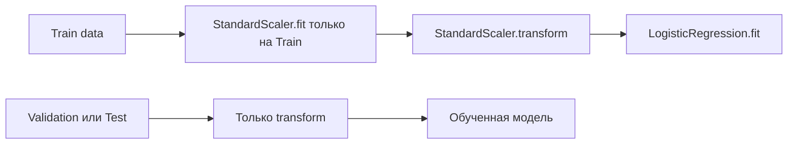
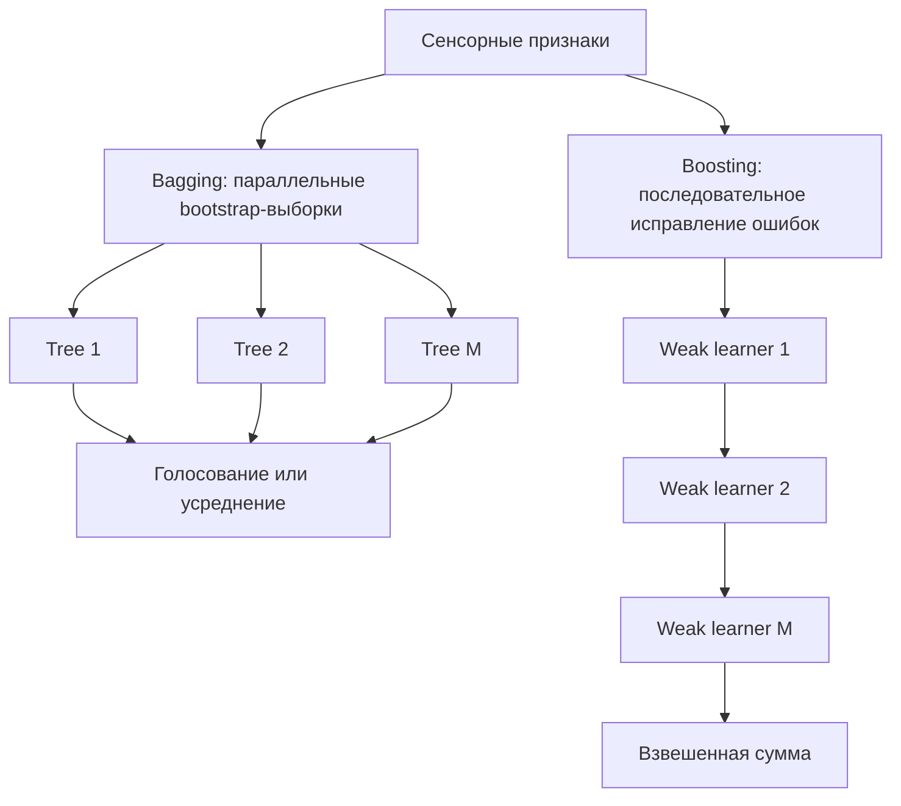
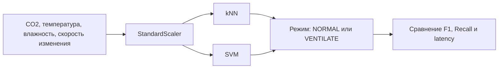
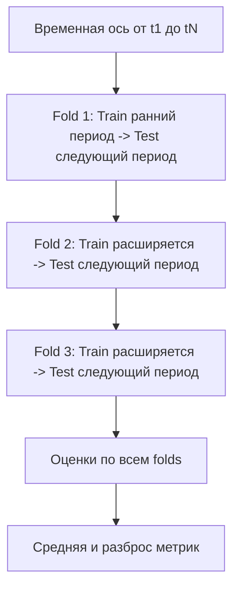

# Раздел 2. «Машинное обучение»

## Дисциплина «Технологии машинного обучения»

**Магистратура 44.04.01 «Педагогическое образование»**  
Профиль: **«Умные системы и интернет вещей в образовании»**

Фокус раздела: классические алгоритмы, временные ряды сенсоров, корректная валидация и воспроизводимый ML-эксперимент.

---

## Результаты освоения раздела

После изучения раздела магистрант должен уметь:

- строить линейные и логистические модели;
- применять регуляризацию и масштабирование;
- использовать решающие деревья и ансамбли;
- применять kNN и SVM;
- выполнять кластеризацию и PCA;
- формировать признаки временных рядов;
- выбирать корректную схему кросс-валидации;
- настраивать гиперпараметры без утечки данных;
- сравнивать модель с baseline;
- интерпретировать качество в контексте IoT и образовательной среды.

---

# Тема 5. Линейная и логистическая регрессия

## Линейная регрессия

Линейная модель:

$$
\hat{y} = w_0 + \sum_{j=1}^{p} w_jx_j.
$$

В векторной форме:

$$
\hat{y}=w^Tx+b.
$$

Пример: прогноз энергопотребления школьной лаборатории по признакам:

- температура;
- влажность;
- время суток;
- занятость;
- мощность активного оборудования.

Коэффициент $w_j$ описывает изменение прогноза при изменении соответствующего признака при прочих равных условиях модели.

---

## Функция потерь для линейной модели

Один из вариантов — среднеквадратичная ошибка:

$$
MSE =
\frac{1}{N}
\sum_{i=1}^{N}
(y_i-\hat{y}_i)^2.
$$

Обучение:

$$
w^* =
\arg\min_w MSE(w).
$$

Преимущество линейной модели — интерпретируемость и сильная baseline-позиция.

Недостаток — неспособность без дополнительных преобразований описывать сложные нелинейные зависимости.

---

## Логистическая регрессия

Для бинарной классификации:

$$
P(y=1|x)
=
\sigma(w^Tx)
=
\frac{1}{1+e^{-w^Tx}}.
$$

Если порог равен $\tau$:

$$
\hat{y}=
\begin{cases}
1, & P(y=1|x)\ge \tau,\\
0, & P(y=1|x)<\tau.
\end{cases}
$$

Порог $\tau=0.5$ не является обязательным. В задачах безопасности его выбирают с учетом цены FN и FP.

---

## Регуляризация L1 и L2

### L2, Ridge

$$
J(w)=
L(w)+\lambda\sum_{j=1}^{p}w_j^2.
$$

Снижает чрезмерный рост коэффициентов.

### L1, Lasso

$$
J(w)=
L(w)+\lambda\sum_{j=1}^{p}|w_j|.
$$

Может занулять часть коэффициентов и выполнять разреженный отбор признаков.

Параметр $\lambda$ управляет компромиссом между качеством подгонки и сложностью модели.

---

## Масштабирование признаков

Признаки могут иметь разные масштабы:

- CO₂: сотни и тысячи ppm;
- влажность: 0–100 %;
- бинарный признак: 0 или 1.

Стандартизация:

$$
z =
\frac{x-\mu}{\sigma}.
$$

В `scikit-learn`:

```python
from sklearn.pipeline import Pipeline
from sklearn.preprocessing import StandardScaler
from sklearn.linear_model import LogisticRegression

model = Pipeline([
    ("scale", StandardScaler()),
    ("clf", LogisticRegression())
])
```

---

## Почему нужен Pipeline

`Pipeline` обеспечивает правильную последовательность преобразований.



Если `StandardScaler.fit()` выполнить до разделения данных, среднее и стандартное отклонение будут содержать информацию из будущей тестовой части.

---

## Кейс: энергопотребление лаборатории

Целевая переменная:

$$
y_t = \text{энергопотребление за интервал }t.
$$

Возможные признаки:

$$
x_t =
[
T_t,
H_t,
CO2_t,
Occupancy_t,
Hour_t,
Weekday_t
].
$$

Сначала строится `DummyRegressor` или прогноз средним значением, затем Ridge и нелинейные модели.

Линейная модель важна как понятная отправная точка, а не как «устаревший» алгоритм.

---

# Тема 6. Деревья решений и ансамблевые методы

## Дерево решений

Дерево рекурсивно разделяет пространство признаков.

Пример правила:

```text
CO2 > 900 ppm?
├── да: Light > 150 lux?
│   ├── да -> Occupied
│   └── нет -> дополнительная проверка
└── нет -> Free
```

Каждое разбиение выбирается так, чтобы повысить однородность дочерних узлов.

---

## Gini и Entropy

Для узла с вероятностями классов $p_k$:

### Gini

$$
Gini =
1-\sum_{k=1}^{K}p_k^2.
$$

### Entropy

$$
H =
-\sum_{k=1}^{K}p_k\log_2 p_k.
$$

Чем меньше нечистота после разбиения, тем более однородными становятся дочерние узлы.

---

## Контроль сложности дерева

Параметры:

- `max_depth`;
- `min_samples_split`;
- `min_samples_leaf`;
- `max_features`.

Слишком глубокое дерево может запомнить шум.

Педагогическое преимущество дерева: правила легко визуализировать, но интерпретируемость не означает причинность.

---

## Random Forest: бэггинг

Идея:

1. строится много деревьев;
2. каждое обучается на bootstrap-выборке;
3. при разбиениях используется случайное подмножество признаков;
4. итог — голосование или усреднение.

$$
\hat{y}
=
\mathrm{mode}
\left(
h_1(x),\ldots,h_M(x)
\right).
$$

Бэггинг прежде всего уменьшает variance.

---

## Gradient Boosting

Бустинг строит модели последовательно.

Каждая новая модель корректирует ошибки предыдущей.

Упрощенно:

$$
F_m(x)=F_{m-1}(x)+\eta h_m(x),
$$

где:

- $h_m$ — очередная слабая модель;
- $\eta$ — learning rate.

Бустинг способен давать высокое качество на табличных данных, но требует аккуратной настройки.

---

## Бэггинг и бустинг над сенсорными данными



---

## Важность признаков: осторожная интерпретация

`feature_importances_` показывает вклад признаков в разбиения деревьев.

Но высокая важность не означает:

- причинность;
- педагогическую значимость;
- отсутствие корреляции с другим признаком.

Для более надежной интерпретации полезно сравнивать:

- impurity-based importance;
- permutation importance;
- результаты при удалении признака.

---

## Кейс: микроклимат

Цель — классифицировать состояние:

- `NORMAL`;
- `VENTILATE`;
- `OVERHEAT`;
- `SENSOR_FAULT`.

Признаки:

- CO₂;
- температура;
- влажность;
- скорость изменения;
- состояние вентиляции;
- время суток.

Дерево удобно как объяснимая baseline-модель, Random Forest — как более устойчивое продолжение.

---

# Тема 7. Методы, основанные на расстояниях и разделяющих поверхностях

## kNN: идея ближайших соседей

Для нового объекта ищутся $k$ ближайших объектов обучающей выборки.

Евклидово расстояние:

$$
d_2(x,z)
=
\sqrt{
\sum_{j=1}^{p}
(x_j-z_j)^2
}.
$$

Манхэттенское расстояние:

$$
d_1(x,z)
=
\sum_{j=1}^{p}
|x_j-z_j|.
$$

Класс определяется голосованием соседей.

---

## Почему kNN требует масштабирования

Пусть:

- CO₂ различается на 500 ppm;
- влажность — на 10 %.

Без масштабирования вклад CO₂ численно доминирует в расстоянии.

Поэтому kNN почти всегда требует:

```text
StandardScaler -> kNN
```

Значение $k$ тоже важно:

- малое $k$ — чувствительность к шуму;
- большое $k$ — чрезмерное сглаживание.

---

## SVM: максимальный зазор

Для линейно разделимых классов ищется гиперплоскость:

$$
w^Tx+b=0.
$$

SVM стремится увеличить расстояние между границей и ближайшими объектами классов.

Эти ближайшие объекты называются **опорными векторами**.

Интуиция: хорошая граница не просто разделяет данные, а делает это с максимально устойчивым зазором.

---

## Kernel Trick

Если классы нелинейно разделимы, можно использовать ядро.

Для RBF:

$$
K(x,z)
=
\exp
\left(
-\gamma \|x-z\|^2
\right).
$$

Ядро позволяет алгоритму работать так, будто данные отображены в более богатое пространство признаков, без явного построения всех новых координат.

Для курса важен принцип, а не полный вывод двойственной задачи SVM.

---

## kNN и SVM в задаче вентиляции



При Edge-развертывании нужно учитывать: kNN хранит обучающие объекты, тогда как компактная линейная SVM может быть значительно легче.

---

# Тема 8. Кластеризация и снижение размерности

## k-means

Задача — разделить объекты на $K$ кластеров.

Функция стоимости:

$$
J =
\sum_{k=1}^{K}
\sum_{x_i \in C_k}
\|x_i-\mu_k\|^2.
$$

Где:

- $C_k$ — кластер;
- $\mu_k$ — его центр.

Алгоритм повторяет:

1. назначение объектов ближайшему центру;
2. пересчет центров;
3. остановку при стабилизации.

---

## Выбор числа кластеров

Число $K$ задается заранее.

Практические подходы:

- предметная постановка;
- elbow method;
- silhouette score;
- стабильность результата.

В образовательном IoT предметная интерпретация особенно важна: кластер без осмысленного описания — только геометрическая группа точек.

---

## PCA: идея

PCA ищет новые ортогональные направления, вдоль которых дисперсия данных максимальна.

После центрирования:

$$
X_c = X-\mu.
$$

Ковариационная матрица:

$$
\Sigma =
\frac{1}{N-1}
X_c^TX_c.
$$

Главные компоненты связаны с собственными векторами $\Sigma$.

---

## Зачем PCA в IoT

В системе может быть 8–20 взаимосвязанных признаков:

- температура;
- влажность;
- CO₂;
- освещенность;
- шум;
- энергопотребление;
- скорость изменения;
- агрегаты по окнам.

PCA позволяет:

- визуализировать в 2D;
- снизить размерность;
- уменьшить коррелированность;
- исследовать режимы работы.

Перед PCA признаки обычно масштабируют.

---

## Кейс: режимы школьной лаборатории


Названия кластеров назначаются **после** анализа их профилей, а не автоматически.

---

# Тема 9. Временные ряды сенсоров

## Что отличает временной ряд

Наблюдения упорядочены по времени:

$$
x_1,x_2,\ldots,x_t,\ldots
$$

В IoT важны:

- timestamp;
- частота дискретизации;
- пропуски;
- сезонность;
- тренд;
- автокорреляция;
- задержка доставки.

Случайное перемешивание может разрушить временную структуру и привести к утечке будущего.

---

## Resampling

Если данные приходят нерегулярно, их приводят к общей временной сетке.

Пример в Pandas:

```python
df = (
    df.set_index("timestamp")
      .resample("5min")
      .mean()
)
```

После resampling необходимо отдельно решать, как заполнять пропуски.

Forward fill допустим не всегда: он предполагает сохранение последнего значения.

---

## Lag features

Лаг:

$$
x_{t-k}.
$$

Для прогноза CO₂:

- `co2_lag_1`;
- `co2_lag_2`;
- `co2_lag_6`.

Если шаг 5 минут:

$$
lag=6
\Rightarrow
30\text{ минут}.
$$

Лаговые признаки позволяют классическим моделям учитывать историю.

---

## Rolling statistics

Скользящее среднее:

$$
\mu_t^{(W)}
=
\frac{1}{W}
\sum_{i=0}^{W-1}
x_{t-i}.
$$

Скользящее стандартное отклонение:

$$
s_t^{(W)}
=
\sqrt{
\frac{1}{W}
\sum_{i=0}^{W-1}
(x_{t-i}-\mu_t^{(W)})^2
}.
$$

Эти признаки описывают локальный уровень и изменчивость.

---

## Горизонт прогноза

Задача:

> предсказать CO₂ через $h=30$ минут.

Если шаг данных 5 минут, то:

$$
h=6
$$

в индексах ряда.

Целевая переменная:

$$
y_t = CO2_{t+6}.
$$

Нужно проследить, чтобы признаки в момент $t$ не включали данные после $t$.

---

## TimeSeriesSplit



Главное правило: **будущее не должно попадать в обучение при оценке прошлого прогноза**.

---

## Простые частотные признаки

Для вибрации и IMU полезно переходить к спектральным признакам.

Например:

- доминирующая частота;
- энергия диапазона;
- спектральный максимум.

Даже без глубоких нейронных сетей это позволяет различать режимы:

- нормальная работа двигателя;
- вибрационная аномалия;
- движение робота;
- покой.

---

# Тема 10. Оценивание, валидация и настройка ML-моделей

## Confusion Matrix

Матрица ошибок показывает структуру решений.

Необходимо анализировать:

- TP;
- TN;
- FP;
- FN.

В образовательном IoT цена ошибок различна:

- FN для аварийного CO₂ может быть опаснее;
- FP может приводить к лишнему включению вентиляции.

Поэтому выбор метрики должен соответствовать сценарию.

---

## ROC-AUC

ROC-кривая строится по:

- True Positive Rate;
- False Positive Rate.

$$
TPR =
\frac{TP}{TP+FN}.
$$

$$
FPR =
\frac{FP}{FP+TN}.
$$

ROC-AUC оценивает способность модели ранжировать положительные и отрицательные объекты по разным порогам.

Для сильно редкого положительного класса дополнительно полезны Precision–Recall характеристики.

---

## Коэффициент детерминации R2

$$
R^2 =
1-
\frac{
\sum_i(y_i-\hat{y}_i)^2
}{
\sum_i(y_i-\bar{y})^2
}.
$$

Интерпретация:

- $R^2=1$ — идеальное совпадение;
- $R^2=0$ — модель не лучше прогноза средним;
- $R^2<0$ — модель хуже простого среднего baseline.

Не следует использовать $R^2$ в отрыве от MAE/RMSE и предметного масштаба ошибки.

---

## Стратегии кросс-валидации

### K-Fold

Для независимых объектов.

### Stratified K-Fold

Сохраняет доли классов.

### GroupKFold

Группы не смешиваются между Train и Validation.

Пример:

```text
group = classroom_id
```

Так одна аудитория целиком попадает только в одну часть.

### TimeSeriesSplit

Для данных с временным порядком.

---

## GroupKFold: зачем он нужен в школе

Пусть данные собраны в 10 аудиториях.

Если случайно смешать минуты из всех помещений, модель может запомнить:

- характерные смещения датчиков;
- типичную температуру;
- особенности освещения.

Для проверки переноса на **новую аудиторию** разделять нужно по `room_id`, а не по отдельным строкам.

---

## Baseline обязателен

Примеры baseline:

### Классификация

- самый частый класс;
- простое правило CO₂ > порога.

### Регрессия

- среднее;
- медиана;
- последнее наблюдение:

$$
\hat{y}_{t+h}=y_t.
$$

Сложная модель должна доказать преимущество перед простым решением.

---

## GridSearchCV и RandomizedSearchCV

`GridSearchCV` перебирает заданную сетку.

`RandomizedSearchCV` случайно выбирает комбинации из распределений.

Важно:

> preprocessing должен находиться внутри `Pipeline`, чтобы на каждом fold обучаться только на обучающей части.

Нельзя сначала масштабировать всю выборку, а затем запускать CV.

---

## Корректный эксперимент


---

## Фундаментальный принцип курса

$$
\text{Результат ML}
=
\text{Качество модели}
+
\text{Корректность эксперимента}.
$$

Высокая метрика не имеет ценности, если:

- тестовая выборка «подсмотрена»;
- временной порядок нарушен;
- одна группа присутствует в обеих частях;
- preprocessing обучен на всей выборке;
- baseline отсутствует;
- метрика не соответствует цене ошибок.

---

## Как выбирать алгоритм в IoT-проекте

| Условие | Разумная отправная точка |
|---|---|
| Требуется интерпретируемая регрессия | Linear/Ridge |
| Бинарная вероятность | Logistic Regression |
| Табличные нелинейные данные | Random Forest/Boosting |
| Мало данных, локальная структура | kNN |
| Четкая граница и хороший scaling | SVM |
| Нет меток | k-means |
| Нужно 2D-представление | PCA |
| Сенсорный временной ряд | lag/rolling + time-aware validation |

Алгоритм выбирают после постановки задачи и схемы валидации.

---

## Итоги раздела

- линейные модели остаются сильными baseline;
- регуляризация контролирует сложность;
- Pipeline защищает от части утечек;
- деревья интерпретируемы, ансамбли повышают устойчивость;
- kNN и SVM требуют внимания к масштабу;
- k-means и PCA решают разные задачи;
- сенсорные ряды требуют time-aware validation;
- GroupKFold важен при переносе между аудиториями;
- baseline обязателен;
- корректный эксперимент важнее «красивой» метрики.

---

## Открытые источники и материалы

1. Stanford CS229: https://cs229.stanford.edu/
2. MIT 6.390 Introduction to Machine Learning: https://introml.mit.edu/
3. UC Berkeley CS189: https://www2.eecs.berkeley.edu/Courses/CS189/
4. Scikit-learn: https://scikit-learn.org/stable/user_guide.html
5. UCI Machine Learning Repository: https://archive.ics.uci.edu/

Материалы следует использовать с учетом лицензий и условий распространения соответствующих источников.
