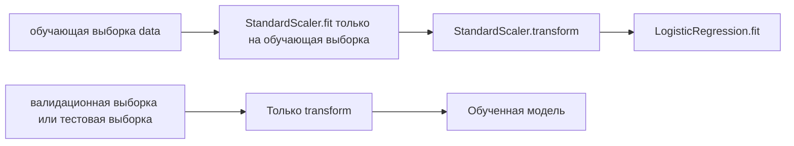
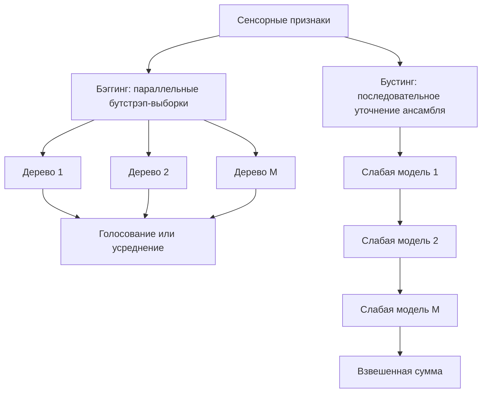
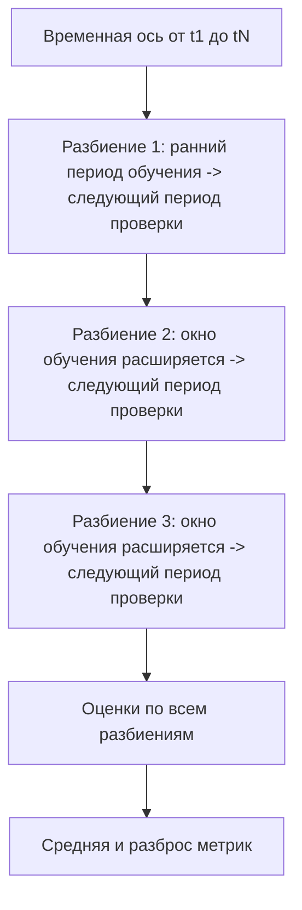

# Раздел 2. «Машинное обучение»

## Дисциплина «Технологии машинного обучения»

**Магистратура 44.04.01 «Педагогическое образование»**  
Профиль: **«Умные системы и интернет вещей в образовании»**

Фокус раздела: классические алгоритмы, временные ряды сенсоров, корректная валидация и воспроизводимый эксперимент по машинному обучению.

---

## Результаты освоения раздела

После изучения раздела магистрант должен уметь:

- строить линейные и логистические модели;
- применять регуляризацию и масштабирование;
- использовать решающие деревья и ансамбли;
- применять kNN и SVM;
- выполнять кластеризацию и PCA;
- формировать признаки временных рядов;
- выбирать корректную схему кросс-валидации;
- настраивать гиперпараметры без утечки данных;
- сравнивать обученную модель с базовой моделью;
- интерпретировать качество в контексте IoT и образовательной среды.

---

## Терминология раздела

В тексте далее используются преимущественно русские термины:

- **базовая модель** — baseline model;
- **конвейер обработки** — pipeline;
- **стандартизация признаков** — standardization;
- **решающее дерево** — decision tree;
- **случайный лес** — random forest;
- **градиентный бустинг** — gradient boosting;
- **метод k ближайших соседей** — kNN;
- **метод опорных векторов** — SVM;
- **метод k-средних** — k-means;
- **метод главных компонент** — PCA;
- **перекрестная проверка (кросс-валидация)** — cross-validation.

Названия классов библиотек (`StandardScaler`, `Pipeline`, `TimeSeriesSplit`) сохраняются в оригинале, поскольку это элементы программного API.

# Тема 5. Линейная и логистическая регрессия

## Линейная регрессия

Линейная модель:

$$ \hat{y} = w_0 + \sum_{j=1}^{p} w_j x_j $$

**Обозначения:** $\hat{y}$ — прогноз; $w_0$ — свободный коэффициент; $w_j$ — вес $j$-го признака; $x_j$ — значение признака; $p$ — число признаков.

**Интерпретация:** каждый коэффициент показывает изменение прогноза при изменении соответствующего признака на единицу при фиксированных остальных признаках.

В векторной форме:

$$ \hat{y} = w^T x + b $$

Это та же линейная модель в векторной записи.

$w$ — вектор весов, $x$ — вектор признаков, $b$ — смещение. Такая форма удобна при реализации матричных вычислений.

Пример: прогноз энергопотребления школьной лаборатории по признакам:

- температура;
- влажность;
- время суток;
- занятость;
- мощность активного оборудования.

Коэффициент $w_j$ описывает изменение прогноза при изменении соответствующего признака при прочих равных условиях модели.

---

## Функция потерь для линейной модели

Один из вариантов — среднеквадратичная ошибка:

$$ MSE = \frac{1}{N}\sum_{i=1}^{N}(y_i-\hat{y}_i)^2 $$

$N$ — число объектов; $y_i$ — фактическое значение; $\hat{y}_i$ — прогноз.

MSE сильнее штрафует крупные ошибки из-за квадрата отклонения и используется как типичная функция потерь линейной регрессии.

Обучение:

$$ w^* = \arg\min_w MSE(w) $$

$w^*$ — набор коэффициентов, при котором MSE минимальна.

**Смысл обучения:** найти такие параметры линейной зависимости, которые наилучшим образом согласуются с обучающими данными по выбранному критерию.

Преимущество линейной модели — интерпретируемость и сильная роль базовой модели.

Недостаток — неспособность без дополнительных преобразований описывать сложные нелинейные зависимости.

---

## Логистическая регрессия

Для бинарной классификации:

$$ p(x) = \frac{1}{1+\exp(-w^T x)} $$

$p(x)$ — оценка вероятности положительного класса; $w^Tx$ — линейная комбинация признаков.

Логистическая функция переводит любое действительное число в интервал от 0 до 1.

Если порог равен $\tau$:

При пороге $\tau$ решение принимается по правилу: если $p(x)\ge\tau$, прогнозируется класс 1; если $p(x)<\tau$, класс 0.

Порог $\tau=0.5$ не является обязательным. Для обнаружения опасного CO₂ порог можно снижать, повышая полноту ценой большего числа ложных тревог.

Порог $\tau=0.5$ не является обязательным. В задачах безопасности его выбирают с учетом цены FN и FP.

---

## Регуляризация L1 и L2

### L2-регуляризация (гребневая регрессия, Ridge)

$$ J_2(w) = L(w) + \lambda\sum_{j=1}^{p}w_j^2 $$

Это L2-регуляризация.

$L(w)$ — исходная функция потерь; $\lambda$ — сила регуляризации. Чем больше $\lambda$, тем сильнее штраф за большие коэффициенты.

Снижает чрезмерный рост коэффициентов.

### L1, Lasso

$$ J_1(w) = L(w) + \lambda\sum_{j=1}^{p}|w_j| $$

Это L1-регуляризация.

Она способствует появлению нулевых коэффициентов и потому может использоваться как механизм разреживания модели и отбора признаков.

Может занулять часть коэффициентов и выполнять разреженный отбор признаков.

Параметр $\lambda$ управляет компромиссом между качеством подгонки и сложностью модели.

---

## Масштабирование признаков

Признаки могут иметь разные масштабы:

- CO₂: сотни и тысячи ppm;
- влажность: 0–100 %;
- бинарный признак: 0 или 1.

Стандартизация:

$$ z = \frac{x-\mu}{s} $$

$x$ — исходное значение; $\mu$ — среднее по обучающей выборке; $s$ — стандартное отклонение по обучающей выборке; $z$ — стандартизованное значение.

Параметры $\mu$ и $s$ нельзя вычислять по тестовым данным.

В `scikit-learn`:

```python
from sklearn.pipeline import Pipeline
from sklearn.предварительная обработка import StandardScaler
from sklearn.linear_model import LogisticRegression

model = Pipeline([
    ("scale", StandardScaler()),
    ("clf", LogisticRegression())
])
```

---

## Почему нужен Pipeline

`Pipeline` обеспечивает правильную последовательность преобразований.



Если `StandardScaler.fit()` выполнить до разделения данных, среднее и стандартное отклонение будут содержать информацию из будущей тестовой части.

---

## Прикладной пример: энергопотребление лаборатории

Целевая переменная:

Пусть $y_t$ обозначает энергопотребление лаборатории на временном интервале $t$.

Цель регрессии — получить прогноз $\hat{y}_t$ по текущим и историческим признакам.

Возможные признаки:

$$ x_t = [T_t,H_t,C_t,O_t,h_t,d_t] $$

$T_t$ — температура; 

$H_t$ — влажность; 

$C_t$ — CO₂; $O_t$ — занятость; 

$h_t$ — час суток; 

$d_t$ — признак дня недели.

Такой вектор объединяет физические и календарные факторы.

Сначала строится `DummyRegressor` или прогноз средним значением, затем гребневая регрессия (Ridge) и нелинейные модели.

Линейная модель важна как понятная отправная точка, а не как «устаревший» алгоритм.

---

# Тема 6. Деревья решений и ансамблевые методы

## Дерево решений

Дерево рекурсивно разделяет пространство признаков.

Пример правила:

```text
CO2 > 900 ppm?
├── да: Light > 150 lux?
│   ├── да -> Occupied
│   └── нет -> дополнительная проверка
└── нет -> Free
```

Каждое разбиение выбирается так, чтобы повысить однородность дочерних узлов.

---

## Gini и Entropy

Для узла с вероятностями классов $p_k$:

### Gini

$$ G = 1-\sum_{k=1}^{K}p_k^2 $$

$G$ — индекс Джини; $p_k$ — доля объектов класса $k$ в узле; $K$ — число классов.

$G=0$ для полностью однородного узла. Чем больше смешаны классы, тем выше неоднородность.

### Entropy

$$ H = -\sum_{k=1}^{K}p_k\log_2 p_k $$

$H$ — энтропия узла; $p_k$ — доля класса $k$.

Разбиение дерева выбирается по уменьшению взвешенной неоднородности дочерних узлов, а не просто по минимальному значению одного из критериев.

Чем меньше взвешенная неоднородность после разбиения, тем более однородными становятся дочерние узлы.

Для кандидата разбиения сравнивают уменьшение критерия:

$$ \Delta I = I_p - \frac{n_l}{n_p}I_l - \frac{n_r}{n_p}I_r $$

$I_p$ — неоднородность родительского узла; $I_l$ и $I_r$ — неоднородности левого и правого дочерних узлов; $n_p$, $n_l$, $n_r$ — соответствующие числа объектов.

**Смысл:** хорошее разбиение должно уменьшать неоднородность с учетом размеров дочерних узлов.

---

## Контроль сложности дерева

Параметры:

- `max_depth`;
- `min_samples_split`;
- `min_samples_leaf`;
- `max_features`.

Слишком глубокое дерево может запомнить шум.

Педагогическое преимущество дерева: правила легко визуализировать, но интерпретируемость не означает причинность.

---

## Случайный лес (Random Forest): бэггинг

Идея:

1. строится много деревьев;
2. каждое обучается на бутстрэп-выборке;
3. при разбиениях используется случайное подмножество признаков;
4. итог — голосование или усреднение.

$$ \hat{y} = \frac{1}{M}\sum_{m=1}^{M}h_m(x) $$

Формула показывает усреднение прогнозов $M$ деревьев в задаче регрессии случайным лесом.

В классификации используют голосование деревьев или усреднение оценок вероятностей классов.

Бэггинг прежде всего уменьшает разброс.

---

## Градиентный бустинг

Бустинг строит модели последовательно.

Каждая новая модель корректирует ошибки предыдущей.

Упрощенно:

$$ F_m(x) = F_{m-1}(x) + \eta h_m(x) $$

$F_m$ — ансамбль после шага $m$; $h_m$ — очередная слабая модель; $\eta$ — коэффициент скорости обучения.

**Точное уточнение:** в градиентном бустинге новая модель аппроксимирует направление отрицательного градиента функции потерь. Для квадратичной ошибки это действительно сводится к обучению на остатках.

где:

- $h_m$ — очередная слабая модель;
- $\eta$ — коэффициент скорости обучения.

Бустинг способен давать высокое качество на табличных данных, но требует аккуратной настройки.

---

## Бэггинг и бустинг над сенсорными данными



---

## Важность признаков: осторожная интерпретация

`feature_importances_` показывает вклад признаков в разбиения деревьев.

Но высокая важность не означает:

- причинность;
- педагогическую значимость;
- отсутствие корреляции с другим признаком.

Для более надежной интерпретации полезно сравнивать:

- важность по снижению неоднородности;
- перестановочная важность;
- результаты при удалении признака.

---

## Прикладной пример: микроклимат

Цель — классифицировать состояние:

- `NORMAL`;
- `VENTILATE`;
- `OVERHEAT`;
- `SENSOR_FAULT`.

Признаки:

- CO₂;
- температура;
- влажность;
- скорость изменения;
- состояние вентиляции;
- время суток.

Решающее дерево удобно как интерпретируемая базовая модель, а случайный лес — как более устойчивый ансамблевый вариант.

---

# Тема 7. Методы, основанные на расстояниях и разделяющих поверхностях

## kNN: идея ближайших соседей

Для нового объекта ищутся $k$ ближайших объектов обучающей выборки.

Евклидово расстояние:

$$ d_2(x,z) = \sqrt{\sum_{j=1}^{p}(x_j-z_j)^2} $$

Это евклидово расстояние между объектами $x$ и $z$.

Если признаки имеют несопоставимые масштабы, крупномасштабный признак будет искусственно доминировать в расстоянии.

Манхэттенское расстояние:

$$ d_1(x,z) = \sum_{j=1}^{p}|x_j-z_j| $$

Это манхэттенское расстояние.

Оно измеряет сумму абсолютных различий по координатам и иногда устойчивее к отдельным большим отклонениям, чем евклидова метрика.

Класс определяется голосованием соседей.

---

## Почему kNN требует масштабирования

Пусть:

- CO₂ различается на 500 ppm;
- влажность — на 10 %.

Без масштабирования вклад CO₂ численно доминирует в расстоянии.

Поэтому kNN почти всегда требует:

```text
StandardScaler -> kNN
```

Значение $k$ тоже важно:

- малое $k$ — чувствительность к шуму;
- большое $k$ — чрезмерное сглаживание.

---

## SVM: максимальный зазор

Для линейно разделимых классов ищется гиперплоскость:

$$ w^T x + b = 0 $$

Это уравнение разделяющей гиперплоскости линейного SVM.

$w$ задает направление нормали к гиперплоскости, $b$ — ее смещение. Опорные векторы — ближайшие к границе обучающие объекты.

SVM стремится увеличить расстояние между границей и ближайшими объектами классов.

Эти ближайшие объекты называются **опорными векторами**.

Интуиция: хорошая граница не просто разделяет данные, а делает это с максимально устойчивым зазором.

---

## ядерный прием (kernel trick)

Если классы нелинейно разделимы, можно использовать ядро.

Для RBF:

$$ K(x,z) = \exp(-\gamma \|x-z\|^2) $$

Это радиально-базисное ядро RBF.

$\gamma$ определяет, насколько быстро убывает влияние объекта с расстоянием. Большое $\gamma$ формирует более локальную и сложную границу решений.

Ядро позволяет алгоритму работать так, будто данные отображены в более богатое пространство признаков, без явного построения всех новых координат.

Для курса важен принцип, а не полный вывод двойственной задачи SVM.

---

## kNN и SVM в задаче вентиляции


При развертывании на периферийном устройстве (Edge) нужно учитывать: kNN хранит обучающие объекты, тогда как компактная линейная SVM может быть значительно легче.

---

# Тема 8. Кластеризация и снижение размерности

## метод k-средних

Задача — разделить объекты на $K$ кластеров.

Функция стоимости:

$$ J = \sum_{k=1}^{K}\sum_{x_i \in C_k}\|x_i-\mu_k\|^2 $$

$C_k$ — $k$-й кластер; $\mu_k$ — его центр; $K$ — число кластеров.

Метод k-средних минимизирует внутрикластерную сумму квадратов расстояний до центров.

Где:

- $C_k$ — кластер;
- $\mu_k$ — его центр.

Алгоритм повторяет:

1. назначение объектов ближайшему центру;
2. пересчет центров;
3. остановку при стабилизации.

---

## Выбор числа кластеров

Число $K$ задается заранее.

Практические подходы:

- предметная постановка;
- метод локтя;
- коэффициент силуэта;
- стабильность результата.

В образовательном IoT предметная интерпретация особенно важна: кластер без осмысленного описания — только геометрическая группа точек.

---

## PCA: идея

PCA ищет новые ортогональные направления, вдоль которых дисперсия данных максимальна.

После центрирования:

$$ X_c = X-\mu $$

$X$ — матрица объектов; $\mu$ — вектор средних значений признаков; $X_c$ — центрированная матрица.

Центрирование — обязательный шаг классического PCA, поскольку компоненты определяются относительно среднего значения данных.

Ковариационная матрица:

$$ \Sigma = \frac{1}{N-1}X_c^T X_c $$

$\Sigma$ — выборочная ковариационная матрица; $N$ — число объектов.

Главные компоненты определяются собственными векторами $\Sigma$, упорядоченными по убыванию соответствующих собственных значений.

Главные компоненты связаны с собственными векторами $\Sigma$.

---

## Зачем PCA в IoT

В системе может быть 8–20 взаимосвязанных признаков:

- температура;
- влажность;
- CO₂;
- освещенность;
- шум;
- энергопотребление;
- скорость изменения;
- агрегаты по окнам.

PCA позволяет:

- визуализировать в 2D;
- снизить размерность;
- уменьшить коррелированность;
- исследовать режимы работы.

Перед PCA признаки обычно масштабируют.

---

## Прикладной пример: режимы школьной лаборатории


Названия кластеров назначаются **после** анализа их профилей, а не автоматически.

---

# Тема 9. Временные ряды сенсоров

## Что отличает временной ряд

Наблюдения упорядочены по времени:

$$ x_1,x_2,\ldots,x_t,\ldots $$

Индекс $t$ задает временной порядок наблюдений.

В отличие от обычной табличной выборки, перестановка строк временного ряда может разрушить причинно-временную структуру эксперимента.

В IoT важны:

- timestamp;
- частота дискретизации;
- пропуски;
- сезонность;
- тренд;
- автокорреляция;
- задержка доставки.

Случайное перемешивание может разрушить временную структуру и привести к утечке будущего.

---

## Пересчет на регулярную временную сетку

Если данные приходят нерегулярно, их приводят к общей временной сетке.

Пример в Pandas:

```python
df = (
    df.set_index("timestamp")
      .resample("5min")
      .mean()
)
```

После пересчет на регулярную временную сетку необходимо отдельно решать, как заполнять пропуски.

Заполнение предыдущим значением (forward fill) допустим не всегда: он предполагает сохранение последнего значения.

---

## Лаговые признаки

Лаг:

$$ x_{t-k} $$

Это лаговый признак: значение сигнала на $k$ шагов раньше момента $t$.

Лаги позволяют классической модели учитывать историю процесса без рекуррентной нейронной сети.

Для прогноза CO₂:

- `co2_lag_1`;
- `co2_lag_2`;
- `co2_lag_6`.

Если шаг 5 минут:

При шаге 5 минут лаг $k=6$ соответствует истории на 30 минут.

Связь проста: горизонт в минутах равен произведению числа шагов на длительность одного шага.

Лаговые признаки позволяют классическим моделям учитывать историю.

---

## Скользящие статистики

Скользящее среднее:

$$ \mu_t^{(W)} = \frac{1}{W}\sum_{i=0}^{W-1}x_{t-i} $$

$\mu_t^{(W)}$ — скользящее среднее; $W$ — длина окна.

Оно описывает локальный уровень сигнала и снижает влияние высокочастотного шума.

Скользящее стандартное отклонение:

$$ s_t^{(W)} = \sqrt{\frac{1}{W}\sum_{i=0}^{W-1}(x_{t-i}-\mu_t^{(W)})^2} $$

$s_t^{(W)}$ — скользящее стандартное отклонение.

Высокое значение может указывать на нестабильность режима, колебания сенсора или начало переходного процесса.

Эти признаки описывают локальный уровень и изменчивость.

---

## Горизонт прогноза

Задача:

> предсказать CO₂ через $h=30$ минут.

Если шаг данных 5 минут, то:

Если данные имеют шаг 5 минут, то горизонт 30 минут соответствует $h=6$ шагам.

Здесь $h$ — именно число временных интервалов, а не физическое время само по себе.

в индексах ряда.

Целевая переменная:

$$ y_t = C_{t+6} $$

$C_{t+6}$ — концентрация CO₂ через шесть пятиминутных интервалов.

При построении признаков для момента $t$ запрещено использовать значения с индексом больше $t$.

Нужно проследить, чтобы признаки в момент $t$ не включали данные после $t$.

---

## TimeSeriesSplit



Главное правило: **будущее не должно попадать в обучение при оценке прошлого прогноза**.

---

## Простые частотные признаки

Для вибрации и IMU полезно переходить к спектральным признакам.

Например:

- доминирующая частота;
- энергия диапазона;
- спектральный максимум.

Даже без глубоких нейронных сетей это позволяет различать режимы:

- нормальная работа двигателя;
- вибрационная аномалия;
- движение робота;
- покой.

---

# Тема 10. Оценивание, валидация и настройка ML-моделей

## Матрица ошибок

Матрица ошибок показывает структуру решений.

Необходимо анализировать:

- TP;
- TN;
- FP;
- FN.

В образовательном IoT цена ошибок различна:

- FN для аварийного CO₂ может быть опаснее;
- FP может приводить к лишнему включению вентиляции.

Поэтому выбор метрики должен соответствовать сценарию.

---

## ROC-AUC

ROC-кривая строится по:

- доля истинно положительных решений;
- доля ложноположительных решений.

$$ TPR = \frac{TP}{TP+FN} $$

TPR совпадает с Recall положительного класса и показывает долю обнаруженных положительных событий.

$$ FPR = \frac{FP}{FP+TN} $$

FPR — доля нормальных объектов, ошибочно признанных положительными.

ROC-кривая показывает компромисс между TPR и FPR при изменении порога классификации.

ROC-AUC оценивает способность модели ранжировать положительные и отрицательные объекты по разным порогам.

Для сильно редкого положительного класса дополнительно полезны Precision–Recall характеристики.

---

## Коэффициент детерминации R2

$$ R^2 = 1-\frac{\sum_i(y_i-\hat{y}_i)^2}{\sum_i(y_i-\bar{y})^2} $$

$\bar{y}$ — среднее фактических значений цели.

$R^2=1$ соответствует идеальному прогнозу; $R^2=0$ — уровню прогноза средним; отрицательное значение означает, что модель хуже такого простого ориентира.

Интерпретация:

- $R^2=1$ — идеальное совпадение;
- $R^2=0$ — модель не лучше прогноза средним;
- $R^2<0$ — модель хуже прогноза постоянным средним значением.

Не следует использовать $R^2$ в отрыве от MAE/RMSE и предметного масштаба ошибки.

---

## Стратегии кросс-валидации

### K-Fold: k-блочная кросс-валидация

Для независимых объектов.

### Stratified K-Fold: стратифицированная кросс-валидация

Сохраняет доли классов.

### GroupKFold: разделение по группам

Группы не смешиваются между обучающая выборка и валидационная выборка.

Пример:

```text
group = classroom_id
```

Так одна аудитория целиком попадает только в одну часть.

### TimeSeriesSplit

Для данных с временным порядком.

---

## Зачем разделять данные по аудиториям: GroupKFold

Пусть данные собраны в 10 аудиториях.

Если случайно смешать минуты из всех помещений, модель может запомнить:

- характерные смещения датчиков;
- типичную температуру;
- особенности освещения.

Для проверки переноса на **новую аудиторию** разделять нужно по `room_id`, а не по отдельным строкам.

---

## Базовая модель обязательна

Примеры базовых моделей:

### Классификация

- самый частый класс;
- простое правило CO₂ > порога.

### Регрессия

- среднее;
- медиана;
- последнее наблюдение:

$$ \hat{y}_{t+h}=y_t $$

Это **персистентная базовая модель** временного ряда: будущее значение считается равным последнему наблюдаемому.

Сложная модель должна показывать измеримое преимущество над таким простым прогнозом.

Сложная модель должна доказать преимущество перед простым решением.

---

## GridSearchCV и RandomizedSearchCV

`GridSearchCV` перебирает заданную сетку.

`RandomizedSearchCV` случайно выбирает комбинации из распределений.

Важно:

> предварительная обработка должен находиться внутри `Pipeline`, чтобы на каждом разбиение обучаться только на обучающей части.

Нельзя сначала масштабировать всю выборку, а затем запускать CV.

---

## Корректный эксперимент


---

## Фундаментальный принцип курса

> **Инженерный принцип:** результат машинного обучения определяется одновременно качеством модели и корректностью экспериментальной процедуры.

Эту мысль лучше выражать как методическое правило, а не как математическое равенство: качество алгоритма не компенсирует утечку данных или неверную схему валидации.

Высокая метрика не имеет ценности, если:

- тестовая выборка «подсмотрена»;
- временной порядок нарушен;
- одна группа присутствует в обеих частях;
- предварительная обработка обучен на всей выборке;
- отсутствует базовая модель для сравнения;
- метрика не соответствует цене ошибок.

---

## Как выбирать алгоритм в проекте IoT

| Условие | Разумная отправная точка |
|---|---|
| Требуется интерпретируемая регрессия | Линейная или гребневая регрессия |
| Бинарная вероятность | Logistic Regression |
| Табличные нелинейные данные | Случайный лес или градиентный бустинг |
| Мало данных, локальная структура | Метод k ближайших соседей |
| Требуется разделяющая граница после масштабирования | Метод опорных векторов |
| Нет целевых меток, требуется группировка | Метод k-средних |
| Нужно двумерное представление | Метод главных компонент (PCA) |
| Сенсорный временной ряд | Лаговые и скользящие признаки + временная валидация |

Алгоритм выбирают после постановки задачи и схемы валидации.

---

## Итоги раздела

- линейные модели остаются важными базовыми моделями;
- регуляризация контролирует сложность;
- Pipeline защищает от части утечек;
- деревья интерпретируемы, ансамбли повышают устойчивость;
- kNN и SVM требуют внимания к масштабу;
- метод k-средних и PCA решают разные задачи;
- сенсорные ряды требуют валидация с учетом временного порядка;
- GroupKFold важен при переносе между аудиториями;
- базовая модель обязательна;
- корректный эксперимент важнее «красивой» метрики.

---

## Основная литература российских авторов

1. **Оськин, Д. А.** Интеллектуальный анализ данных : учебник для вузов / Д. А. Оськин, Н. Г. Левченко, Н. А. Седова. — Санкт-Петербург : Лань, 2026. — 228 с. — ISBN 978-5-507-56021-9. — URL: https://lanbook.ru/catalog/informatika/intellektualnyy-analiz-dannykh/ (дата обращения: 10.09.2026).
2. **Миркин, Б. Г.** Базовые методы анализа данных : учебник и практикум для вузов / Б. Г. Миркин. — 3-е изд., перераб. и доп. — Москва : Юрайт, 2026. — 297 с. — ISBN 978-5-534-19709-9. — URL: https://urait.ru/bcode/583143 (дата обращения: 10.09.2026).
3. **Анализ данных** : учебник для вузов / под ред. В. С. Мхитаряна. — Москва : Юрайт, 2026. — 448 с. — ISBN 978-5-534-19964-2. — URL: https://urait.ru/bcode/583032 (дата обращения: 10.09.2026).
4. **Трубочкина, Н. К.** Основы технологии производства и машинное обучение : учебник для вузов / Н. К. Трубочкина. — Москва : Юрайт, 2026. — 383 с. — ISBN 978-5-534-22010-0. — URL: https://urait.ru/bcode/600548 (дата обращения: 10.09.2026).

---

## Дополнительные открытые материалы

1. Stanford CS229 Machine Learning — https://cs229.stanford.edu/
2. MIT 6.390 Introduction to Machine Learning — https://introml.mit.edu/
3. UC Berkeley CS189 Introduction to Machine Learning — https://www2.eecs.berkeley.edu/Courses/CS189/
4. Scikit-learn User Guide — https://scikit-learn.org/stable/user_guide.html
5. UCI Machine Learning Repository — https://archive.ics.uci.edu/
6. GitHub Docs: математические выражения — https://docs.github.com/en/get-started/writing-on-github/working-with-advanced-formatting/writing-mathematical-expressions

