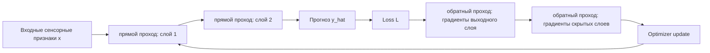
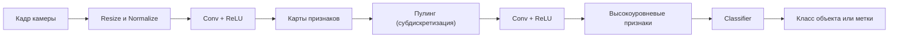
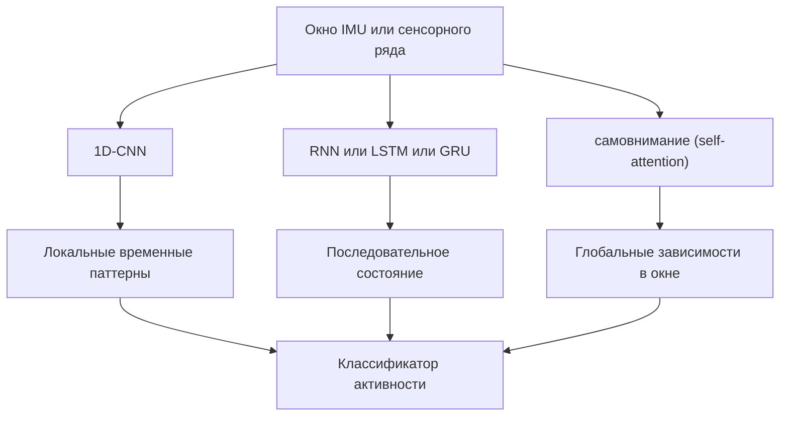
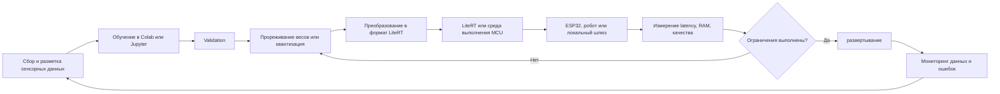
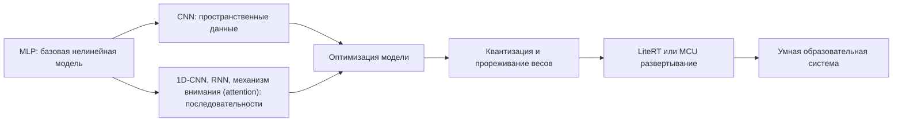

# Раздел 3. «Глубокое обучение»

## Дисциплина «Технологии машинного обучения»

**Магистратура 44.04.01 «Педагогическое образование»**  
Профиль: **«Умные системы и интернет вещей в образовании»**

Фокус раздела: нейронные сети, компьютерное зрение, модели последовательностей, TinyML и развертывание моделей на периферийных устройствах (Edge).

---

## Результаты освоения раздела

После изучения раздела магистрант должен уметь:

- объяснять работу искусственного нейрона и MLP;
- понимать Прямой проход и обратное распространение ошибки;
- выбирать функции активации и оптимизатор;
- строить базовую CNN;
- применять Перенос обучения (transfer learning);
- различать 1D-CNN, RNN, LSTM/GRU и самовнимание (self-attention);
- проектировать модель для IMU-временного ряда;
- оценивать ограничения по памяти, задержке вычисления и энергопотреблению;
- выполнять квантизацию;
- объяснять цикл «обучение → преобразование → развертывание → мониторинг» для периферийного ИИ (Edge AI).

---

## Терминология раздела

Основные термины используются в следующей форме:

- **прямой проход** — forward pass;
- **обратное распространение ошибки** — backpropagation;
- **коэффициент скорости обучения** — learning rate;
- **пакет** — batch;
- **карта признаков** — feature map;
- **сверточная нейронная сеть** — CNN;
- **перенос обучения** — transfer learning;
- **дообучение** — fine-tuning;
- **механизм внимания** — attention;
- **вывод модели** — inference;
- **периферийный ИИ** — Edge AI;
- **прореживание весов** — pruning;
- **квантизация** — quantization.

Названия архитектур и API (`ReLU`, `Adam`, `LiteRT`) сохраняются как международные технические обозначения.

# Тема 11. Нейрон и многослойный перцептрон

## Искусственный нейрон

Линейная комбинация:

$$ z = Wx+b $$

$x$ — входной вектор; $W$ — матрица весов; $b$ — смещение; $z$ — линейная комбинация входов.

Эта часть нейрона сама по себе является линейным преобразованием.

Активация:

$$ a = \phi(z) $$

$\phi$ — функция активации; $a$ — выход нейрона.

Нелинейная активация позволяет многослойной сети описывать зависимости, которые невозможно представить одной линейной моделью.

Где:

- $x$ — входной вектор;
- $W$ — веса;
- $b$ — смещение;
- $\phi$ — нелинейная функция.

Без нелинейности несколько линейных слоев сводятся к одной линейной модели.

---

## ReLU, Sigmoid и GELU

### ReLU

$$ R(z) = \max(0,z) $$

Это функция ReLU.

Она оставляет положительные значения без изменения и заменяет отрицательные нулем. ReLU проста вычислительно и широко применяется в скрытых слоях.

Проста и эффективна для скрытых слоев.

### Sigmoid

$$ S(z) = \frac{1}{1+\exp(-z)} $$

Это сигмоидальная функция.

Она переводит значение $z$ в интервал от 0 до 1 и потому часто используется на выходе бинарного классификатора как параметр вероятностной оценки.

Удобна для вероятности бинарного класса на выходе.

### GELU

Приближенно:

$$ G(z) \approx 0.5z[1+\tanh(\sqrt{2/\pi}(z+0.044715z^3))] $$

$G(z)$ — приближение функции GELU.

GELU плавно масштабирует вход вместо жесткого обнуления отрицательной части и широко применяется в трансформерных архитектурах.

GELU широко используется в современных глубоких архитектурах.

---

## Многослойный перцептрон

Для слоев $l=1,\ldots,L$:

$$ z^{(l)} = W^{(l)}a^{(l-1)}+b^{(l)} $$

$l$ — номер слоя; $a^{(l-1)}$ — выход предыдущего слоя; $W^{(l)}$ и $b^{(l)}$ — параметры текущего слоя.

Формула описывает линейную часть вычислений слоя.

$$ a^{(l)} = \phi^{(l)}(z^{(l)}) $$

После линейного преобразования применяется функция активации $\phi^{(l)}$.

Последовательное повторение этих двух операций образует многослойный перцептрон.

Схематично:

```text
Input -> Dense -> ReLU -> Dense -> ReLU -> Output
```

MLP подходит для табличных и агрегированных сенсорных признаков.

---

## Функция потерь

Для бинарной классификации часто применяется Binary Cross-Entropy:

$$ L = -\frac{1}{N}\sum_{i=1}^{N}[y_i\log p_i+(1-y_i)\log(1-p_i)] $$

$L$ — бинарная кросс-энтропия; $p_i$ — прогноз вероятности положительного класса; $y_i$ — истинная метка 0 или 1.

Функция сильно штрафует уверенные ошибочные вероятностные прогнозы.

Для многоклассовой задачи используется кросс-энтропия по классам.

Функция потерь задает то, что оптимизатор пытается уменьшить.

---

## Градиентный спуск

Обновление параметров:

$$ \theta_{t+1} = \theta_t-\eta\nabla_{\theta}L(\theta_t) $$

$\theta_t$ — параметры до шага обновления; $\eta$ — коэффициент скорости обучения; $\nabla_{\theta}L$ — градиент функции потерь.

Параметры изменяются в направлении, противоположном росту функции потерь.

где $\eta$ — коэффициент скорости обучения.

Если $\eta$ слишком велик:

- обучение может быть нестабильным.

Если слишком мал:

- обучение может быть слишком медленным.

Типовые оптимизаторы:

- SGD;
- Adam.

---

## Обратное распространение ошибки (backpropagation)

Обратное распространение ошибки (backpropagation) вычисляет градиенты функции потерь по параметрам через правило цепочки.

Для композиции:

$$ y=f(g(x)) $$

Композиция $f(g(x))$ иллюстрирует, что выход одной операции становится входом следующей.

Нейронная сеть состоит из большого числа таких вложенных преобразований.

имеем:

$$ \frac{dy}{dx} = \frac{df}{dg}\frac{dg}{dx} $$

Это правило цепочки для композиции двух функций.

Обратное распространение ошибки систематически применяет это правило от выходного слоя к ранним слоям сети.

Нейросеть — длинная композиция операций, поэтому градиенты распространяются от выхода к ранним слоям.

---

## Прямой проход и обратное распространение ошибки



прямой проход вычисляет прогноз, обратный проход — как изменить параметры, чтобы уменьшить ошибку.

---

## Эпоха, Пакет (batch), Learning Rate

**Эпоха** — один проход по всей обучающей выборке.

**Пакет (batch)** — подмножество, по которому вычисляется один шаг градиента.

Если $N$ объектов и размер batch равен $B$, число шагов примерно:

$$ S = \left\lceil\frac{N}{B}\right\rceil $$

$N$ — число обучающих объектов; $B$ — размер пакета; $S$ — число шагов обновления параметров за одну эпоху.

Знак округления вверх учитывает последний неполный пакет.

Коэффициент скорости обучения определяет величину обновления параметров.

---

## Переобучение нейронной сети

Признаки:

- ошибка на обучающей выборке продолжает падать;
- ошибка на валидационной выборке начинает расти.

Средства:

- L2-регуляризация весов (weight decay);
- Dropout;
- ранняя остановка (early stopping);
- аугментация данных;
- уменьшение модели;
- увеличение выборки.

Dropout случайно отключает часть активаций во время обучения и снижает зависимость сети от отдельных нейронов.

---

## Прикладной пример: состояние сенсорной сети

Вход:

$$ x_t = [C_t,T_t,H_t,L_t,D_{C,t},D_{T,t},P_t,B_t] $$

$C_t$ — CO₂; $T_t$ — температура; $H_t$ — влажность; $L_t$ — освещенность; $D_{C,t}$ и $D_{T,t}$ — изменения CO₂ и температуры; $P_t$ — показатель потерь пакетов; $B_t$ — состояние питания.

Такой вектор можно подавать на вход MLP после нормализации.

Классы:

- `NORMAL`;
- `VENTILATE`;
- `SENSOR_FAULT`;
- `COMMUNICATION_FAULT`.

MLP позволяет моделировать нелинейные взаимодействия, например сочетание роста CO₂, отсутствия пакетов и состояния батареи.

---

# Тема 12. Сверточные нейронные сети и компьютерное зрение

## Почему CNN

Обычный MLP не учитывает пространственную структуру изображения.

CNN использует:

- локальные рецептивные поля;
- разделяемые веса;
- иерархию признаков.

На ранних слоях могут выделяться края и текстуры, на более глубоких — сложные формы.

---

## Операция свертки

Для двумерного изображения упрощенно:

$$ Y_{i,j} = \sum_m\sum_n X_{i+m,j+n}K_{m,n} $$

$X$ — входная карта; $K$ — ядро свертки; $Y$ — выходная карта признаков.

Фильтр перемещается по изображению и вычисляет локальную взвешенную сумму. В реальных CNN дополнительно учитываются каналы, шаг и дополнение границ.

Где:

- $X$ — вход;
- $K$ — ядро;
- $Y$ — карта признаков.

На практике используются несколько фильтров, формирующих несколько feature maps.

---

## Карты признаков и Пулинг (субдискретизация)

**Карта признаков** — результат применения фильтра.

Пулинг (субдискретизация) уменьшает пространственное разрешение.

Например Max Пулинг (субдискретизация):

$$ y = \max(x_1,x_2,\ldots,x_k) $$

Это операция max-pooling в одном локальном окне.

Из нескольких значений сохраняется максимальная активация, что уменьшает пространственный размер представления.

в локальном окне.

Преимущества:

- уменьшение вычислений;
- некоторое повышение устойчивости к малым смещениям;
- постепенное увеличение эффективного рецептивного поля.

---

## Базовая CNN

```text
Image
-> Conv
-> ReLU
-> Pool
-> Conv
-> ReLU
-> Pool
-> Flatten or Global Пулинг (субдискретизация)
-> Linear
-> Class probabilities
```

Для учебной задачи достаточно небольшой сети, чтобы магистрант мог проследить размеры тензоров и число параметров.

---

## Конвейер CNN



---

## Аугментация данных

Для ограниченной выборки применяют:

- небольшие повороты;
- crop;
- изменение яркости;
- горизонтальное отражение, если оно не меняет смысл;
- добавление умеренного шума.

Принцип:

> аугментация должна сохранять целевой класс.

Для цифр и символов некоторые преобразования могут менять смысл, поэтому правила определяются предметной областью.

---

## Перенос обучения (transfer learning)

Идея:

1. взять сеть, предобученную на большой выборке;
2. заменить классификационную голову;
3. сначала обучить новую голову;
4. при необходимости разморозить часть слоев и выполнить дообучение.

Преимущество: хорошее качество на небольшом специализированном датасете.

---

## Дообучение (дообучение)

Слишком высокий коэффициент скорости обучения может разрушить полезные предобученные признаки.

Обычно дообучение выполняется с меньшим $\eta$.

Можно:

- заморозить базовую часть сети (backbone);
- обучить классификационную головку;
- постепенно разморозить верхние блоки.

Это особенно полезно для небольших наборов изображений лабораторного оборудования.

---

## Образовательные CV-кейсы

### Интерактивная доска

Распознавание символов и схем.

### Учебный мобильный робот

Распознавание:

- навигационных меток;
- цветовых зон;
- препятствий.

### Лабораторный стенд

Контроль:

- положения переключателя;
- наличия детали;
- состояния индикатора.

Важно учитывать приватность: камера не должна автоматически превращаться в систему идентификации людей.

---

# Тема 13. Модели последовательностей

## Сенсорный ряд как последовательность

IMU формирует последовательность:

$$ x_t = [a_x(t),a_y(t),a_z(t),g_x(t),g_y(t),g_z(t)] $$

Первые три компоненты — ускорения по осям; последние три — угловые скорости гироскопа.

Последовательность таких векторов описывает движение робота или жест пользователя во времени.

Для распознавания жеста важен не только текущий вектор, но и его изменение во времени.

Обычно последовательность разбивается на окна длины $W$.

---

## 1D-CNN

Одномерная свертка проходит вдоль временной оси.

Преимущества:

- локальные шаблоны;
- параллельное вычисление;
- хорошая эффективность;
- вычислительная эффективность, удобная для периферийных устройств.

1D-CNN может распознавать локальные паттерны вибрации или движения без рекуррентного состояния.

---

## RNN

Рекуррентная сеть поддерживает скрытое состояние:

$$ h_t = \phi(W_xx_t+W_hh_{t-1}+b) $$

$h_t$ — скрытое состояние RNN в момент $t$; $x_t$ — текущий вход; $h_{t-1}$ — предыдущее состояние.

Таким образом сеть явно переносит информацию от предыдущего шага к следующему.

Проблемы классической RNN:

- затухающие градиенты;
- трудно хранить долгие зависимости.

Поэтому используются LSTM и GRU.

---

## LSTM и GRU: концепция вентилей

LSTM управляет информацией через механизмы:

- forget gate;
- input gate;
- output gate.

GRU использует более компактную структуру с update/reset gate.

Методический смысл:

> сеть учится решать, какую информацию сохранить, обновить или забыть.

Для курса важна архитектурная идея, а не запоминание полного набора уравнений LSTM.

---

## механизм внимания (attention)

Scaled Dot-Product механизм внимания (attention):

$$ A(Q,K,V) = S\left(\frac{QK^T}{\sqrt{d_k}}\right)V $$

$Q$ — запросы; $K$ — ключи; $V$ — значения; $d_k$ — размерность ключей; $S(\cdot)$ обозначает функцию softmax.

Масштабирование на $\sqrt{d_k}$ ограничивает рост скалярных произведений, а softmax превращает оценки сходства в веса внимания.

Где:

- $Q$ — запросы;
- $K$ — ключи;
- $V$ — значения.

Механизм оценивает, какие элементы последовательности наиболее значимы друг для друга.

---

## самовнимание (self-attention)

В самовнимание (self-attention):

- $Q$;
- $K$;
- $V$

получаются из одной последовательности.

Это позволяет каждой временной позиции учитывать другие позиции напрямую.

Преимущество по сравнению с классической RNN — более параллельная обработка и удобное моделирование дальних зависимостей.

---

## Сравнение моделей последовательностей



Выбор зависит от длины ряда, вычислительных ограничений и требуемой точности.

---

## Прикладной пример: распознавание жестов по IMU

Устройство:

- ESP32;
- акселерометр/гироскоп;
- окно 1–2 секунды.

Цель:

```text
LEFT
RIGHT
UP
DOWN
STOP
```

Этапы:

1. синхронизация IMU;
2. нормализация;
3. нарезка окон;
4. обучение;
5. оценка F1;
6. оптимизация;
7. развертывание на периферийном устройстве.

---

# Тема 14. TinyML и периферийный ИИ (Edge AI)

## Облачный и периферийный вывод модели

### Облачный вывод

Плюсы:

- мощные вычисления;
- централизованное управление.

Минусы:

- сеть обязательна;
- задержка;
- передача данных;
- риски приватности.

### Периферийное устройство

Инференс выполняется непосредственно:

- на микроконтроллере;
- одноплатном компьютере;
- роботе;
- локальном шлюзе.

---

## Зачем периферийные вычисления нужны в образовании

Сценарии:

- мобильный робот реагирует без подключения к Интернету;
- датчик определяет аномалию локально;
- камера анализирует объект без отправки изображения в облако;
- wearable распознает движение;
- лабораторный стенд продолжает работать при потере сети.

Периферийный вывод повышает автономность, но вводит жесткие ограничения по памяти, времени вычисления и энергопотреблению.

---

## Многокритериальная оптимизация

Для TinyML недостаточно максимизировать Accuracy/F1.

Цель:

$$ Q \rightarrow \max $$

$Q$ — выбранная метрика качества модели, например $F_1$.

В TinyML цель состоит не в безусловной максимизации качества, а в поиске лучшего качества при ресурсных ограничениях.

при ограничениях:

$$ M \le M_{max} $$

$M$ — потребление памяти моделью; $M_{max}$ — доступный лимит на целевом устройстве.

Следует учитывать как размер модели во Flash, так и рабочую RAM.

$$ T \le T_{max} $$

$T$ — задержка одного вывода модели; $T_{max}$ — максимально допустимая задержка.

Для управляющего робота это ограничение связано с требуемым временем реакции системы.

$$ E \le E_{max} $$

$E$ — энергетические затраты; $E_{max}$ — допустимый бюджет.

Для автономных устройств этот критерий влияет на время работы от аккумулятора.

Иногда чуть меньшая точность приемлема, если модель становится достаточно компактной и быстрой.

---

## Метрики целевого периферийного устройства

### Размер модели

KB или MB во Flash.

### Пиковое потребление RAM

Максимальная оперативная память.

### Задержка

$$ L = t_2-t_1 $$

$L$ — задержка одного вывода модели; $t_1$ и $t_2$ — моменты начала и окончания вычисления.

Измерять задержку следует на целевом устройстве, а не только в Colab.

### Пропускная способность

$$ R = \frac{N}{T} $$

$R$ — пропускная способность; $N$ — число выполненных выводов; $T$ — суммарное время измерения.

Единица измерения — число выводов в секунду.

### Энергопотребление

Оценивают энергию на один вывод модели либо среднюю мощность в рабочем режиме.

---

## Прореживание весов (pruning)

Прореживание весов (pruning) удаляет малозначимые веса или структуры.

Идея:

$$ w_i \rightarrow 0 $$

Идея прореживания: малозначимые веса $w_i$ зануляются или удаляются.

Однако ускорение возникает только тогда, когда программная и аппаратная платформа умеет эффективно использовать разреженную структуру.

для параметров, вклад которых мал.

Различают:

- unstructured прореживание весов;
- structured прореживание весов.

Реальный выигрыш в latency зависит от того, поддерживает ли аппаратная платформа разреженные вычисления.

---

## Квантизация после обучения (Post-Training Quantization)

FP32 использует 32-битные значения.

INT8 — 8-битные.

Упрощенная аффинная схема:

$$ r \approx s(q-z) $$

$r$ — исходное вещественное значение; $q$ — целое квантованное значение; $s$ — масштаб; $z$ — нулевая точка.

Эта аффинная связь лежит в основе распространенных схем INT8-квантизации.

где:

- $r$ — реальное значение;
- $q$ — квантованное целое;
- $s$ — scale;
- $z$ — zero point.

Квантизация уменьшает объем памяти для весов и на поддерживаемом оборудовании часто ускоряет вывод модели.

---

## Цена квантизации

До оптимизации:

$$ F_{1,a}=0.94 $$

$F_{1,a}$ — значение $F_1$ исходной модели до квантизации.

Индекс $a$ используется как условное обозначение исходной точности, чтобы не помещать текстовые макросы внутри формулы GitHub Math.

После:

$$ F_{1,q}=0.925 $$

$F_{1,q}$ — значение $F_1$ квантованной модели.

Сравнение выполняют на одной и той же тестовой выборке.

Потеря:

$$ \Delta F_1 = F_{1,a}-F_{1,q}=0.015 $$

$\Delta F_1$ — абсолютная потеря качества после квантизации.

В примере она равна 0.015, то есть 1.5 процентного пункта. Принимать такой компромисс можно только вместе с оценкой выигрыша в памяти и задержке.

Если размер уменьшился в четыре раза, инженер должен оценить, допустим ли такой trade-off для целевого сценария.

---

## LiteRT: современная среда Google AI Edge

Google использует название **LiteRT** для современного высокопроизводительного времени выполнения моделей на устройствах; ранее оно называлось TensorFlow Lite.

Современная логика разработки:

```text
Обучение модели
-> оптимизация и квантизация
-> преобразование
-> среда выполнения LiteRT
-> локальный вывод на устройстве
```

LiteRT — среда выполнения моделей непосредственно на устройстве. В зависимости от платформы вычисления могут выполняться на CPU, GPU или NPU.

Для 32-битных микроконтроллеров применяется **LiteRT for Microcontrollers** — современное название направления, ранее известного как TensorFlow Lite for Microcontrollers / TFLite Micro. В официальной документации 2026 года прямо указана поддержка ESP32-DevKitC и ESP-EYE.

---

## TinyML на микроконтроллере

Типовой MCU-контур:

- ESP32 / совместимый микроконтроллер;
- сенсор;
- буфер окна;
- preprocessing;
- локальный вывод модели;
- локальное действие.

Ограничения:

- десятки или сотни KB RAM;
- ограниченная Flash;
- отсутствие полноценной ОС;
- требования реального времени;
- питание от батареи.

---

## Цикл «обучение → преобразование → развертывание»



---

## Практический критерий выбора модели

| Модель | F1 | Размер | Задержка | RAM |
|---|---:|---:|---:|---:|
| MLP FP32 | 0.94 | 420 KB | 18 ms | 95 KB |
| MLP INT8 | 0.93 | 112 KB | 8 ms | 41 KB |
| 1D-CNN INT8 | 0.95 | 180 KB | 14 ms | 68 KB |

Лучшей является не обязательно самая точная модель, а модель, удовлетворяющая ограничениям платформы.

---

## Периферийный вывод и приватность

Локальный вывод модели на периферийном устройстве может уменьшить передачу исходных данных.

Например:

```text
камера -> локальная CNN -> "маркер обнаружен"
```

вместо:

```text
камера -> видеопоток -> облако
```

Однако перенос вычислений на устройство сам по себе не гарантирует приватность.

Нужно отдельно контролировать:

- хранение;
- логи;
- доступ;
- обновление моделей;
- безопасность прошивки.

---

## Надежность TinyML-системы

модель машинного обучения должна работать вместе с инженерными защитами:

- диапазонный контроль сенсора;
- watchdog;
- тайм-ауты;
- контроль пропусков;
- безопасное состояние;
- ручной режим;
- журнал ошибок.

Для образовательного робота ошибочный вывод модели не должен приводить к небезопасному действию.

---

## Как связаны темы раздела



Глубокое обучение в данном курсе заканчивается не на `model.fit()`, а на измеряемом развертывании.

---

## Итоги раздела

- MLP строится из линейных преобразований и нелинейных активаций;
- backpropagation обеспечивает вычисление градиентов;
- CNN учитывает пространственную структуру изображений;
- Перенос обучения (transfer learning) критически полезен при небольших образовательных датасетах;
- 1D-CNN, RNN и механизм внимания (attention) дают разные способы обработки последовательностей;
- TinyML требует учитывать память, задержку вычисления и энергопотребление;
- прореживание весов и quantization — основные методы компрессии;
- LiteRT является современным развитием TensorFlow Lite для ИИ непосредственно на устройстве;
- периферийный ИИ должен оцениваться одновременно по качеству модели и потреблению ресурсов;
- безопасное применение требует инженерных fallback-механизмов.

---

## Основная литература российских авторов

1. **Николенко, С. И.** Глубокое обучение : погружение в мир нейронных сетей / С. И. Николенко, А. А. Кадурин, Е. О. Архангельская. — Санкт-Петербург : Питер, 2026. — 480 с. — ISBN 978-5-4461-1537-2. — URL: https://www.piter.com/collection/A31900/product/glubokoe-obuchenie-2 (дата обращения: 10.09.2026).
2. **Бессмертный, И. А.** Системы искусственного интеллекта : учебник для вузов / И. А. Бессмертный. — 3-е изд., испр. и доп. — Москва : Юрайт, 2026. — 139 с. — ISBN 978-5-534-22188-6. — URL: https://urait.ru/bcode/600881 (дата обращения: 10.09.2026).
3. **Рабчевский, А. Н.** Синтетические данные и развитие нейросетевых технологий : учебник для вузов / А. Н. Рабчевский. — Москва : Юрайт, 2026. — 187 с. — ISBN 978-5-534-17716-9. — URL: https://urait.ru/bcode/589394 (дата обращения: 10.09.2026).
4. **Денисова, О. А.** Цифровизация образования: нейросети и искусственный интеллект в обучении : учебное пособие для вузов / О. А. Денисова. — Санкт-Петербург : Лань, 2026. — 104 с. — ISBN 978-5-507-54007-5. — URL: https://lanbook.ru/catalog/informatika/tsifrovizatsiya-obrazovaniya-neyroseti-i-iskusstvennyy-intellekt-v-obuchenii/ (дата обращения: 10.09.2026).

---

## Открытые материалы и официальная документация

1. Stanford CS231n: Deep Learning for Computer Vision — https://cs231n.stanford.edu/
2. MIT 6.5940 TinyML and Efficient AI Computing — https://hanlab.mit.edu/
3. Google AI Edge: LiteRT for Microcontrollers — https://developers.google.com/edge/litert/microcontrollers/overview
4. Google AI Edge: Build and convert models — https://developers.google.com/edge/litert/microcontrollers/build_convert
5. PyTorch Tutorials — https://pytorch.org/tutorials/
6. TensorFlow — https://www.tensorflow.org/
7. UCI Human Activity Recognition Using Smartphones — https://archive.ics.uci.edu/dataset/240/human+activity+recognition+using+smartphones
8. GitHub Docs: математические выражения — https://docs.github.com/en/get-started/writing-on-github/working-with-advanced-formatting/writing-mathematical-expressions

**Актуализация 2026:** в официальной документации Google используется название `LiteRT for Microcontrollers`; среда рассчитана на 32-битные микроконтроллеры и содержит поддержку ESP32.
