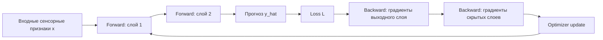
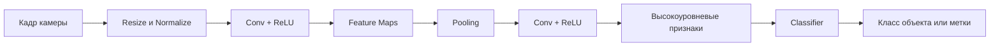
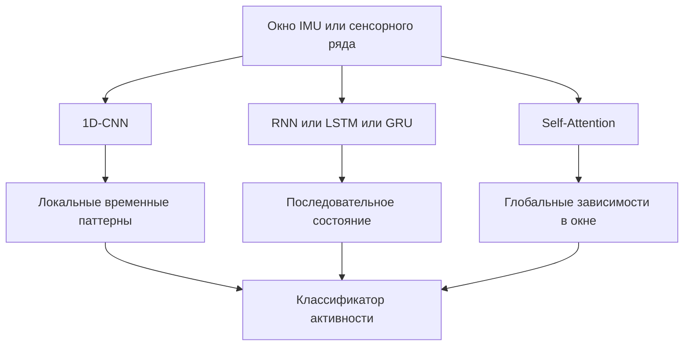
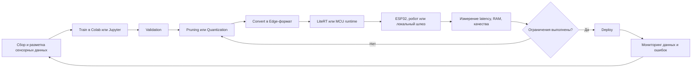
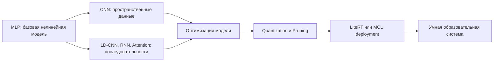

# Раздел 3. «Глубокое обучение»

## Дисциплина «Технологии машинного обучения»

**Магистратура 44.04.01 «Педагогическое образование»**  
Профиль: **«Умные системы и интернет вещей в образовании»**

Фокус раздела: нейронные сети, компьютерное зрение, последовательности, TinyML и развертывание моделей на Edge-устройствах.

---

## Результаты освоения раздела

После изучения раздела магистрант должен уметь:

- объяснять работу искусственного нейрона и MLP;
- понимать Forward и Backward pass;
- выбирать функции активации и оптимизатор;
- строить базовую CNN;
- применять Transfer Learning;
- различать 1D-CNN, RNN, LSTM/GRU и Self-Attention;
- проектировать модель для IMU-временного ряда;
- оценивать ограничения Memory, Latency и Energy;
- выполнять квантизацию;
- объяснять цикл Train → Convert → Deploy → Monitor для Edge ML.

---

# Тема 11. Нейрон и многослойный перцептрон

## Искусственный нейрон

Линейная комбинация:

$$
z=Wx+b.
$$

Активация:

$$
a=\phi(z).
$$

Где:

- $x$ — входной вектор;
- $W$ — веса;
- $b$ — смещение;
- $\phi$ — нелинейная функция.

Без нелинейности несколько линейных слоев сводятся к одной линейной модели.

---

## ReLU, Sigmoid и GELU

### ReLU

$$
ReLU(z)=\max(0,z).
$$

Проста и эффективна для скрытых слоев.

### Sigmoid

$$
\sigma(z)=\frac{1}{1+e^{-z}}.
$$

Удобна для вероятности бинарного класса на выходе.

### GELU

Приближенно:

$$
GELU(z)
\approx
0.5z
\left[
1+
\tanh
\left(
\sqrt{\frac{2}{\pi}}
\left(
z+0.044715z^3
\right)
\right)
\right].
$$

GELU широко используется в современных глубоких архитектурах.

---

## Многослойный перцептрон

Для слоев $l=1,\ldots,L$:

$$
z^{(l)} =
W^{(l)}a^{(l-1)}+b^{(l)},
$$

$$
a^{(l)} =
\phi^{(l)}(z^{(l)}).
$$

Схематично:

```text
Input -> Dense -> ReLU -> Dense -> ReLU -> Output
```

MLP подходит для табличных и агрегированных сенсорных признаков.

---

## Функция потерь

Для бинарной классификации часто применяется Binary Cross-Entropy:

$$
L =
-\frac{1}{N}
\sum_{i=1}^{N}
\left[
y_i\log \hat{p}_i
+
(1-y_i)\log(1-\hat{p}_i)
\right].
$$

Для многоклассовой задачи используется кросс-энтропия по классам.

Функция потерь задает то, что оптимизатор пытается уменьшить.

---

## Градиентный спуск

Обновление параметров:

$$
\theta_{t+1}
=
\theta_t
-
\eta
\nabla_\theta L(\theta_t),
$$

где $\eta$ — learning rate.

Если $\eta$ слишком велик:

- обучение может быть нестабильным.

Если слишком мал:

- обучение может быть слишком медленным.

Типовые оптимизаторы:

- SGD;
- Adam.

---

## Backpropagation

Backpropagation вычисляет градиенты функции потерь по параметрам через правило цепочки.

Для композиции:

$$
y=f(g(x)),
$$

имеем:

$$
\frac{dy}{dx}
=
\frac{df}{dg}
\frac{dg}{dx}.
$$

Нейросеть — длинная композиция операций, поэтому градиенты распространяются от выхода к ранним слоям.

---

## Forward и Backward pass



Forward вычисляет прогноз, Backward — как изменить параметры, чтобы уменьшить ошибку.

---

## Epoch, Batch, Learning Rate

**Epoch** — один проход по всей обучающей выборке.

**Batch** — подмножество, по которому вычисляется один шаг градиента.

Если $N$ объектов и размер batch равен $B$, число шагов примерно:

$$
S =
\left\lceil
\frac{N}{B}
\right\rceil.
$$

Learning rate определяет величину обновления параметров.

---

## Переобучение нейронной сети

Признаки:

- train loss продолжает падать;
- validation loss начинает расти.

Средства:

- weight decay;
- Dropout;
- early stopping;
- augmentation;
- уменьшение модели;
- увеличение выборки.

Dropout случайно отключает часть активаций во время обучения и снижает зависимость сети от отдельных нейронов.

---

## Кейс: состояние сенсорной сети

Вход:

$$
x =
[
CO2,
T,
H,
Light,
\Delta CO2,
\Delta T,
PacketLoss,
Battery
].
$$

Классы:

- `NORMAL`;
- `VENTILATE`;
- `SENSOR_FAULT`;
- `COMMUNICATION_FAULT`.

MLP позволяет моделировать нелинейные взаимодействия, например сочетание роста CO₂, отсутствия пакетов и состояния батареи.

---

# Тема 12. Сверточные нейронные сети и компьютерное зрение

## Почему CNN

Обычный MLP не учитывает пространственную структуру изображения.

CNN использует:

- локальные рецептивные поля;
- разделяемые веса;
- иерархию признаков.

На ранних слоях могут выделяться края и текстуры, на более глубоких — сложные формы.

---

## Операция свертки

Для двумерного изображения упрощенно:

$$
Y_{i,j}
=
\sum_m
\sum_n
X_{i+m,j+n}K_{m,n}.
$$

Где:

- $X$ — вход;
- $K$ — ядро;
- $Y$ — карта признаков.

На практике используются несколько фильтров, формирующих несколько feature maps.

---

## Feature Maps и Pooling

**Feature map** — результат применения фильтра.

Pooling уменьшает пространственное разрешение.

Например Max Pooling:

$$
y =
\max(x_1,x_2,\ldots,x_k)
$$

в локальном окне.

Преимущества:

- уменьшение вычислений;
- некоторое повышение устойчивости к малым смещениям;
- постепенное увеличение эффективного рецептивного поля.

---

## Базовая CNN

```text
Image
-> Conv
-> ReLU
-> Pool
-> Conv
-> ReLU
-> Pool
-> Flatten or Global Pooling
-> Linear
-> Class probabilities
```

Для учебной задачи достаточно небольшой сети, чтобы магистрант мог проследить размеры тензоров и число параметров.

---

## Конвейер CNN



---

## Data Augmentation

Для ограниченной выборки применяют:

- небольшие повороты;
- crop;
- изменение яркости;
- горизонтальное отражение, если оно не меняет смысл;
- добавление умеренного шума.

Принцип:

> аугментация должна сохранять целевой класс.

Для цифр и символов некоторые преобразования могут менять смысл, поэтому правила определяются предметной областью.

---

## Transfer Learning

Идея:

1. взять сеть, предобученную на большой выборке;
2. заменить классификационную голову;
3. сначала обучить новую голову;
4. при необходимости разморозить часть слоев и выполнить fine-tuning.

Преимущество: хорошее качество на небольшом специализированном датасете.

---

## Fine-tuning

Слишком высокий learning rate может разрушить полезные предобученные признаки.

Обычно fine-tuning выполняется с меньшим $\eta$.

Можно:

- заморозить backbone;
- обучить classifier;
- постепенно разморозить верхние блоки.

Это особенно полезно для небольших наборов изображений лабораторного оборудования.

---

## Образовательные CV-кейсы

### Интерактивная доска

Распознавание символов и схем.

### Учебный мобильный робот

Распознавание:

- навигационных меток;
- цветовых зон;
- препятствий.

### Лабораторный стенд

Контроль:

- положения переключателя;
- наличия детали;
- состояния индикатора.

Важно учитывать Privacy: камера не должна автоматически превращаться в систему идентификации людей.

---

# Тема 13. Модели последовательностей

## Сенсорный ряд как последовательность

IMU формирует последовательность:

$$
x_t =
[
a_x(t),
a_y(t),
a_z(t),
g_x(t),
g_y(t),
g_z(t)
].
$$

Для распознавания жеста важен не только текущий вектор, но и его изменение во времени.

Обычно последовательность разбивается на окна длины $W$.

---

## 1D-CNN

Одномерная свертка проходит вдоль временной оси.

Преимущества:

- локальные шаблоны;
- параллельное вычисление;
- хорошая эффективность;
- удобство для Edge.

1D-CNN может распознавать локальные паттерны вибрации или движения без рекуррентного состояния.

---

## RNN

Рекуррентная сеть поддерживает скрытое состояние:

$$
h_t =
\phi(
W_xx_t
+
W_hh_{t-1}
+
b
).
$$

Проблемы классической RNN:

- затухающие градиенты;
- трудно хранить долгие зависимости.

Поэтому используются LSTM и GRU.

---

## LSTM и GRU: концепция вентилей

LSTM управляет информацией через механизмы:

- forget gate;
- input gate;
- output gate.

GRU использует более компактную структуру с update/reset gate.

Методический смысл:

> сеть учится решать, какую информацию сохранить, обновить или забыть.

Для курса важна архитектурная идея, а не запоминание полного набора уравнений LSTM.

---

## Attention

Scaled Dot-Product Attention:

$$
Attention(Q,K,V)
=
\mathrm{softmax}
\left(
\frac{QK^T}{\sqrt{d_k}}
\right)V.
$$

Где:

- $Q$ — запросы;
- $K$ — ключи;
- $V$ — значения.

Механизм оценивает, какие элементы последовательности наиболее значимы друг для друга.

---

## Self-Attention

В Self-Attention:

- $Q$;
- $K$;
- $V$

получаются из одной последовательности.

Это позволяет каждой временной позиции учитывать другие позиции напрямую.

Преимущество по сравнению с классической RNN — более параллельная обработка и удобное моделирование дальних зависимостей.

---

## Сравнение моделей последовательностей



Выбор зависит от длины ряда, вычислительных ограничений и требуемой точности.

---

## Кейс: распознавание жестов по IMU

Устройство:

- ESP32;
- акселерометр/гироскоп;
- окно 1–2 секунды.

Цель:

```text
LEFT
RIGHT
UP
DOWN
STOP
```

Этапы:

1. синхронизация IMU;
2. нормализация;
3. нарезка окон;
4. обучение;
5. оценка F1;
6. оптимизация;
7. Edge-развертывание.

---

# Тема 14. TinyML и Edge ML

## Cloud vs Edge

### Cloud

Плюсы:

- мощные вычисления;
- централизованное управление.

Минусы:

- сеть обязательна;
- задержка;
- передача данных;
- риски приватности.

### Edge

Инференс выполняется непосредственно:

- на микроконтроллере;
- одноплатном компьютере;
- роботе;
- локальном шлюзе.

---

## Зачем Edge в образовании

Сценарии:

- мобильный робот реагирует без подключения к Интернету;
- датчик определяет аномалию локально;
- камера анализирует объект без отправки изображения в облако;
- wearable распознает движение;
- лабораторный стенд продолжает работать при потере сети.

Edge повышает автономность, но вводит жесткие ресурсные ограничения.

---

## Многокритериальная оптимизация

Для TinyML недостаточно максимизировать Accuracy/F1.

Цель:

$$
\max \mathrm{Quality}
$$

при ограничениях:

$$
\mathrm{Memory}\le M_{\max},
$$

$$
\mathrm{Latency}\le T_{\max},
$$

$$
\mathrm{Energy}\le E_{\max}.
$$

Иногда чуть меньшая точность приемлема, если модель становится достаточно компактной и быстрой.

---

## Метрики Edge-устройства

### Размер модели

KB или MB во Flash.

### Peak RAM

Максимальная оперативная память.

### Latency

$$
Latency =
t_{end}-t_{start}.
$$

### Throughput

$$
Throughput =
\frac{N_{inference}}{T}.
$$

### Energy

Энергия на один inference либо среднее потребление в рабочем режиме.

---

## Pruning

Pruning удаляет малозначимые веса или структуры.

Идея:

$$
w_i \rightarrow 0
$$

для параметров, вклад которых мал.

Различают:

- unstructured pruning;
- structured pruning.

Реальный выигрыш в latency зависит от того, поддерживает ли аппаратная платформа разреженные вычисления.

---

## Post-Training Quantization

FP32 использует 32-битные значения.

INT8 — 8-битные.

Упрощенная аффинная схема:

$$
r \approx s(q-z),
$$

где:

- $r$ — реальное значение;
- $q$ — квантованное целое;
- $s$ — scale;
- $z$ — zero point.

Квантизация уменьшает память и часто ускоряет inference.

---

## Цена квантизации

До оптимизации:

$$
F_{1,FP32}=0.94.
$$

После:

$$
F_{1,INT8}=0.925.
$$

Потеря:

$$
\Delta F_1
=
0.94-0.925
=
0.015.
$$

Если размер уменьшился в четыре раза, инженер должен оценить, допустим ли такой trade-off для целевого сценария.

---

## LiteRT: современный стек Google AI Edge

TensorFlow Lite переименован в **LiteRT**.

Современная логика разработки:

```text
Train model
-> Optimize / Quantize
-> Convert
-> LiteRT runtime
-> On-device inference
```

LiteRT развивается как runtime для on-device AI и поддерживает современный сценарий ускорения на CPU/GPU/NPU в зависимости от платформы.

Для микроконтроллеров сохраняется специализированный TinyML-сценарий семейства LiteRT/TFLite Micro.

---

## TinyML на микроконтроллере

Типовой MCU-контур:

- ESP32 / совместимый микроконтроллер;
- сенсор;
- буфер окна;
- preprocessing;
- inference;
- локальное действие.

Ограничения:

- десятки или сотни KB RAM;
- ограниченная Flash;
- отсутствие полноценной ОС;
- требования реального времени;
- питание от батареи.

---

## Цикл Train → Convert → Deploy



---

## Практический критерий выбора модели

| Модель | F1 | Размер | Latency | RAM |
|---|---:|---:|---:|---:|
| MLP FP32 | 0.94 | 420 KB | 18 ms | 95 KB |
| MLP INT8 | 0.93 | 112 KB | 8 ms | 41 KB |
| 1D-CNN INT8 | 0.95 | 180 KB | 14 ms | 68 KB |

Лучшей является не обязательно самая точная модель, а модель, удовлетворяющая ограничениям платформы.

---

## Edge и приватность

Edge inference может уменьшить передачу сырых данных.

Например:

```text
камера -> локальная CNN -> "маркер обнаружен"
```

вместо:

```text
камера -> видеопоток -> облако
```

Однако Edge сам по себе не гарантирует Privacy.

Нужно отдельно контролировать:

- хранение;
- логи;
- доступ;
- обновление моделей;
- безопасность прошивки.

---

## Надежность TinyML-системы

ML-модель должна работать вместе с инженерными защитами:

- диапазонный контроль сенсора;
- watchdog;
- тайм-ауты;
- контроль пропусков;
- безопасное состояние;
- ручной режим;
- журнал ошибок.

Для образовательного робота неверный inference не должен приводить к небезопасному действию.

---

## Как связаны темы раздела



Глубокое обучение в данном курсе заканчивается не на `model.fit()`, а на измеряемом развертывании.

---

## Итоги раздела

- MLP строится из линейных преобразований и нелинейных активаций;
- backpropagation обеспечивает вычисление градиентов;
- CNN учитывает пространственную структуру изображений;
- Transfer Learning критически полезен при небольших образовательных датасетах;
- 1D-CNN, RNN и Attention дают разные способы обработки последовательностей;
- TinyML вводит ограничения Memory, Latency и Energy;
- pruning и quantization — основные методы компрессии;
- LiteRT является современным развитием TensorFlow Lite для on-device AI;
- Edge ML должен оцениваться по качеству и ресурсам одновременно;
- безопасное применение требует инженерных fallback-механизмов.

---

## Открытые источники и материалы

1. Stanford CS231n: https://cs231n.stanford.edu/
2. MIT 6.390 Introduction to Machine Learning: https://introml.mit.edu/
3. MIT 6.5940 TinyML and Efficient AI Computing: https://hanlab.mit.edu/
4. Google AI Edge / LiteRT: https://ai.google.dev/edge/litert
5. PyTorch Tutorials: https://pytorch.org/tutorials/
6. TensorFlow / Keras: https://www.tensorflow.org/
7. UCI Human Activity Recognition Using Smartphones: https://archive.ics.uci.edu/dataset/240/human+activity+recognition+using+smartphones

Материалы следует использовать с учетом лицензий и условий распространения соответствующих источников.
